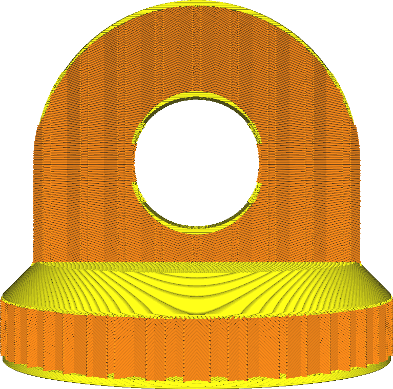
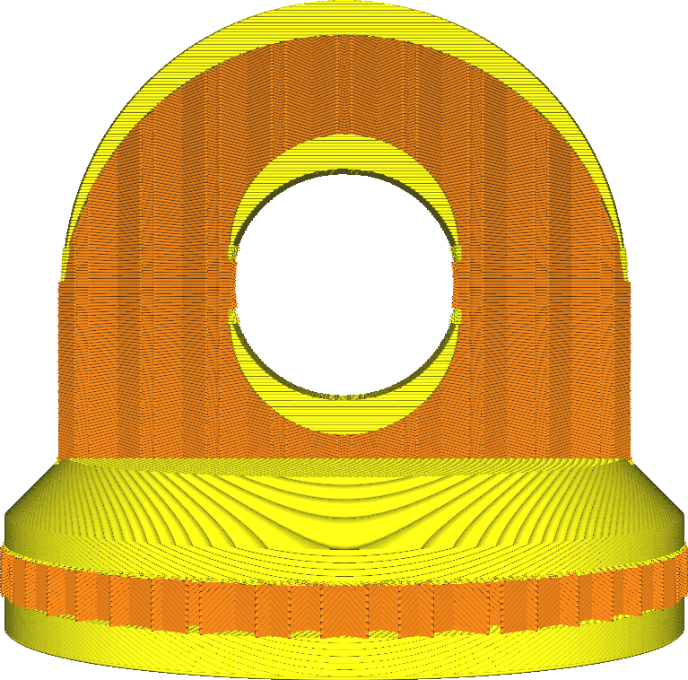

Obere/untere Dicke
====
Mit der Dicke oben/unten können Sie einstellen, wie dick die Außenhaut an der Ober- und Unterseite Ihres Drucks sein soll.

<!--screenshot {
"image_path": "top_bottom_thickness_0.8.png",
"models": [{"script": "stamp.scad"}],
"camera_position": [0, 203, 30],
"settings": {
    "wall_line_count": 0,
    "top_bottom_thickness": 0.8
},
"colours": 64
}-->
<!--screenshot {
"image_path": "top_bottom_thickness_3.png",
"models": [{"script": "stamp.scad"}],
"camera_position": [0, 203, 30],
"settings": {
    "wall_line_count": 0,
    "top_bottom_thickness": 3
},
"colours": 64
}-->

Dies betrifft sowohl die Ober- als auch die Unterseite des Drucks. Die Ober- und Unterseite können auch einzeln mit den Einstellungen [Obere Dicke](top_thickness.md) und [Untere Dicke](bottom_thickness.md) konfiguriert werden.

Wenn diese Einstellung nicht dem Vielfachen der Höhe der Schicht entspricht, wird sie auf das nächste Vielfache gerundet. Diese Einstellung bestimmt nur, wie viele Schichten oben und unten erzeugt werden.

Eine größere Dicke an der Ober- und Unterseite hat mehrere Auswirkungen, die sich positiv auf die Gesamtqualität, aber negativ auf die Produktivität auswirken.
* Ihr Teil wird stabiler sein. Mehr obere Schichten bedeuten, dass ein kleinerer Teil Ihres Drucks mit wenig Füllung gefüllt wird. Stattdessen wird er vollständig ausgefüllt.
* Die Oberseite wird glatter sein. Eventuelle Unebenheiten in der Außenhaut werden durch die darüber liegenden Schichten geglättet.
* Es ist wahrscheinlicher, dass Ihr Modell wasserdicht ist. Sowohl auf der Ober- als auch auf der Unterseite befinden sich mehr Schichten, um das Eindringen von Wasser oder anderen Flüssigkeiten zu verhindern und um Überhänge auszugleichen.
* Ihr Druck wird mehr Material verbrauchen, da mehr Schichten vollständig gefüllt werden.
* Der Druck dauert länger, da mehr Material aufgetragen werden muss und diese Schichten normalerweise langsamer gedruckt werden als die Füllung.
