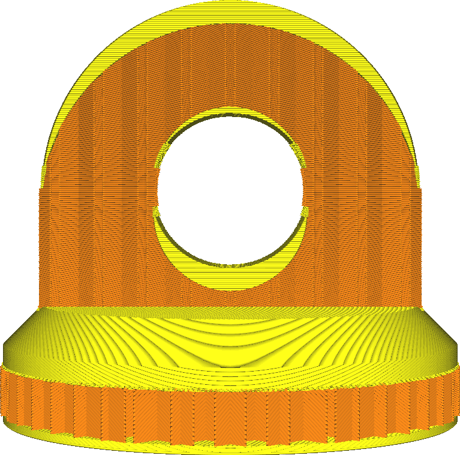

Obere Schichten
====
Mit dieser Einstellung wird festgelegt, wie viele feste Schichten an der Oberseite des Drucks gedruckt werden. Diese festen Schichten werden anstelle der Füllung gedruckt. Sie sind dazu gedacht, die Oberseite zu schließen.

<!--screenshot {
"image_path": "top_bottom_thickness_0.8.png",
"models": [{"script": "stamp.scad"}],
"camera_position": [0, 203, 30],
"settings": {
    "wall_line_count": 0,
    "top_bottom_thickness": 0.8
},
"colours": 64
}-->
<!--screenshot {
"image_path": "top_thickness.png",
"models": [{"script": "stamp.scad"}],
"camera_position": [0, 203, 30],
"settings": {
    "wall_line_count": 0,
    "top_thickness": 3
},
"colours": 64
}-->

Mehr Schichten haben mehrere Auswirkungen, die sich positiv auf die Qualität der Oberfläche auswirken, aber negativ auf die Produktivität.
* Ihr Teil wird stabiler sein. Mehr obere Schichten bedeuten, dass ein kleinerer Teil Ihres Drucks mit wenig Füllung gefüllt wird. Stattdessen wird er vollständig ausgefüllt.
* Die Oberseite wird glatter sein. Eventuelle Unebenheiten in der Außenhaut werden durch die darüber liegenden Schichten geglättet.
* Es ist wahrscheinlicher, dass Ihr Modell wasserdicht ist. Mehr Schichten auf der Oberseite können das Eindringen von Wasser oder anderen Flüssigkeiten verhindern, da mehr Schichten vollständig gefüllt sind.
* Ihr Druck wird mehr Material verbrauchen, da mehr Schichten vollständig gefüllt sind.
* Ihr Druck dauert länger, da mehr Material nach unten gelegt werden muss und diese Schichten normalerweise langsamer gedruckt werden als die Füllung.