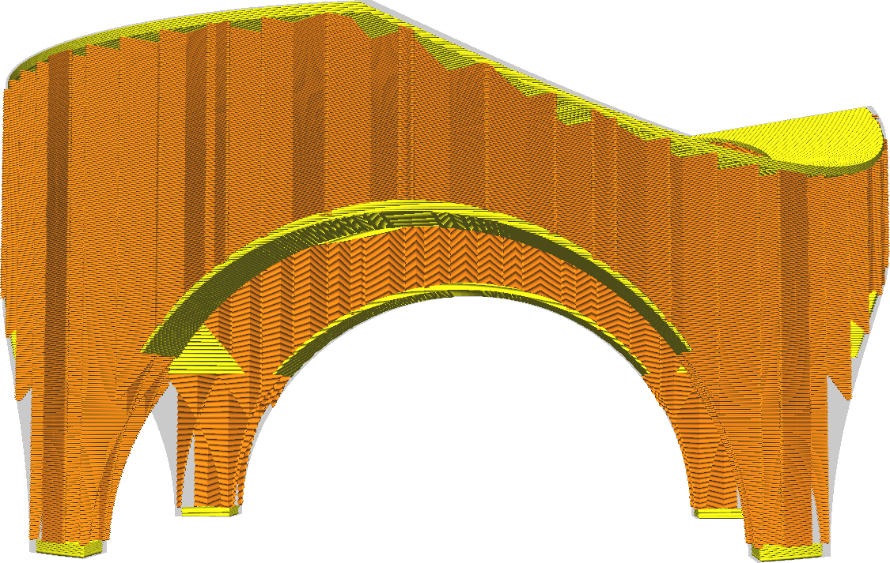
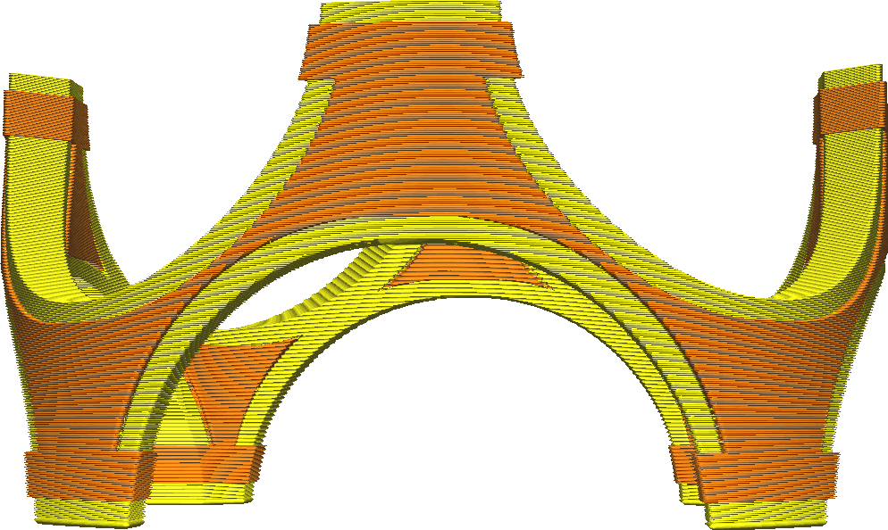

Expansionsdistanz Außenhaut oben
====
Verbreitert oder verkleinert die festen Schichten auf der Oberseite des Drucks in horizontaler Richtung. Normalerweise werden die festen Schichten nur unterhalb von Teilen erzeugt, unter denen sich Luft befindet. Mit dieser Einstellung können Sie sie jedoch horizontal etwas weiter ausdehnen und so die Festigkeit verbessern, indem die Außenhaut besser an den angrenzenden Wänden haftet und Lücken in der Haut geschlossen werden.

* Wenn Sie kleine Löcher in den oberen Schichten der Außenhaut haben (Löcher, die mit dem Füllmuster gefüllt werden), können Sie diese mit einem etwas höheren Wert schließen. Dadurch kann der Drucker kontinuierlich untere Linien drucken, was die Festigkeit erheblich verbessert.
* Wenn die Unterseite Ihres Drucks nicht flach ist, bewirkt eine höhere Einstellung, dass die Außenhaut über den Bereich hinaus gedruckt wird, der sich direkt über den Wänden befindet. Dadurch wird die Haftung zwischen der Außenhaut und den Wänden verbessert, was wiederum die Festigkeit erhöht.
* Wenn Sie diese Einstellung auf einen negativen Wert setzen, wird die Breite der unteren Schichten verringert und durch Füllmaterial ersetzt. Dies kann eine gewisse Zeitersparnis beim Drucken bedeuten, geht aber auf Kosten der Festigkeit.

**Aufgrund technischer Beschränkungen können Sie diese Einstellung nicht unter den Wert von [Breite für das Entfernen der Außenhaut oben](top_skin_preshrink.md) verringern. Erhöhen Sie die Einstellung für die "Breite für das Entfernen der Außenhaut oben", um mehr Außenhaut zu entfernen.**