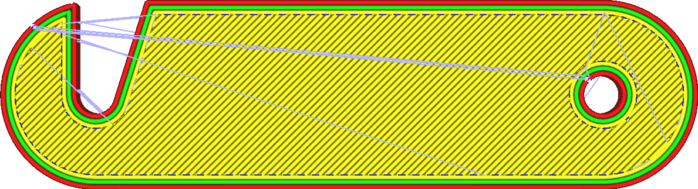
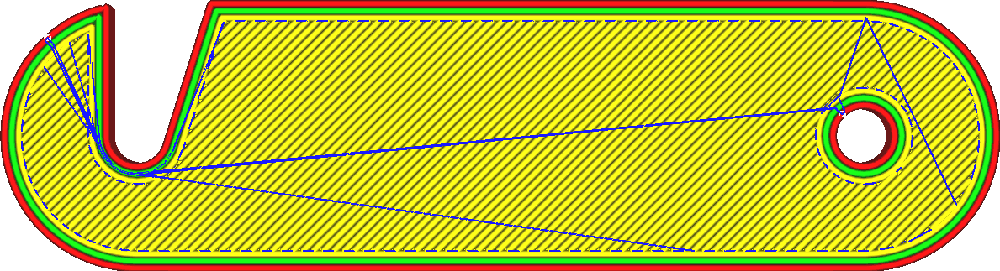

Combing-Modus
====
Beim Combing wird vermieden, die Wände des Drucks zu überqueren, wenn man von einer Stelle zur anderen fährt. Das Überqueren der Wände hinterlässt in der Regel eine Narbe auf der Oberfläche, wenn die heiße Düse aus dem Druck austritt oder eintritt, was im Allgemeinen unerwünscht ist.

Das Combing allein bewirkt nur, dass die Düse die Wände vermeidet, wenn sie durch das Innere des Meshes fährt. Die Funktion [Gedruckte Teile bei Bewegung umgehen](travel_avoid_other_parts.md) sorgt jedoch dafür, dass die Düse auch Objekte außerhalb des Bereichs meidet.

<!--screenshot {
"image_path": "retraction_combing_off.png",
"models": [
    {
        "script": "safety_lock.scad",
        "scad_params": ["length=40"]
    }
],
"camera_position": [0, 0, 120],
"structures": ["travels", "helpers", "shell", "infill", "starts"],
"settings": {"retraction_combing": "off"},
"minimum_layer": 2,
"colours": 64
}-->
<!--screenshot {
"image_path": "retraction_combing_on.png",
"models": [
    {
        "script": "safety_lock.scad",
        "scad_params": ["length=40"]
    }
],
"camera_position": [0, 0, 120],
"structures": ["travels", "helpers", "shell", "infill", "starts"],
"settings": {"retraction_combing": "all"},
"minimum_layer": 2,
"colours": 64
}-->

Wenn es einen Weg vom Start- zum Endpunkt gibt, der durch das Objekt führt, ohne auf Wände zu stoßen, wird dieser Weg genommen, ohne einen Einzug vorzunehmen. Liegen Start- und Endpunkt auf völlig getrennten Wegen, bewegt sich die Düse zunächst zu der Position, an der die beiden Teile am nächsten beieinander liegen, zieht dann optional ein (wenn [Einzug aktiviert ist](retraction_enable.md)), fährt zum Zielweg, schiebt optional zurück und bewegt sich dann durch den neuen Teil zu seinem endgültigen Ziel. In beiden Teilen wird vermieden, die Wände zu berühren, während er durch das Innere fährt. Bei der Bewegung von Teil zu Teil werden Teile nur vermieden, wenn die Einstellung [Gedruckte Teile bei Bewegung umgehen](travel_avoid_other_parts.md) aktiviert ist.

Das Ziel des Combing ist es, das Durchdringen der Wände des Objekts zu vermeiden und die Anzahl der Spuren auf der Oberfläche zu reduzieren. Außerdem wird dadurch das auf der Außenseite sichtbare Stringing reduziert, da während des Fahrwegs austretendes Filament auf der Innenseite des Modells platziert wird. Combing erhöht jedoch auch die Länge des Fahrwegs. Manchmal muss er einen großen Umweg machen.

Es gibt vier Optionen in der Dropdown-Liste für diese Einstellung:
* **Aus**: Combing ist deaktiviert. Fahrwege werden immer direkt zum Zielort geführt. Wenn dabei keine Wände betroffen sind, wird nicht eingezogen.
* **Alle**: Die Düse trifft keine Wände, während sie durch das Innere des Drucks fährt, wie oben beschrieben.
* **Nicht in der Außenhaut**: Die Düse trifft nach Möglichkeit auch nicht auf die Außenhaut. Dadurch kann die Kratzspur auf der Oberseite des Drucks verringert werden, da die Düse an den Wänden entlang fährt und nicht durch die Außenhaut hindurch. In einigen Fällen kann die Düse jedoch nicht ausweichen und es muss eingezogen werden, da sie sonst die Außenhaut verletzt würde.
**Innerhalb der Füllung**: Dieser Modus ist der strengste von allen und erlaubt nur das Combing durch die Füllung. Dadurch wird vermieden, dass die Düse sowohl die Innen- als auch die Außenwände und auch die Außenhaut trifft. Wenn die Düse auf die Innenwände trifft, kann es manchmal vorkommen, dass es außen noch sichtbar ist, weil der Außenradius der Düse breiter ist als die Wände. Dies verhindert diesen Effekt. Allerdings muss noch häufiger eingezogen werden, da oft kein Weg zur Verfügung steht.