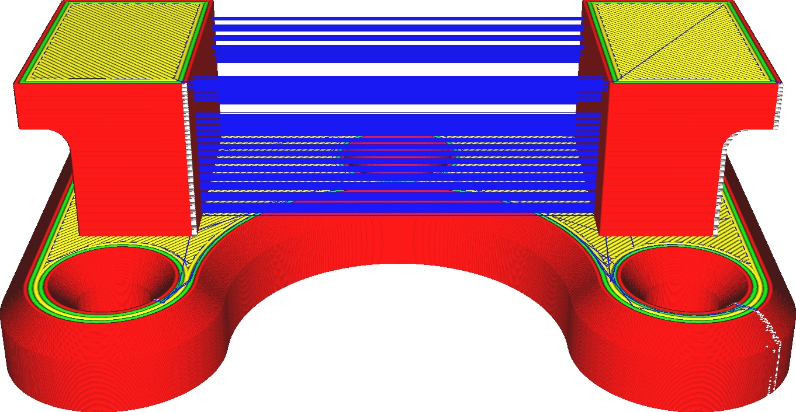
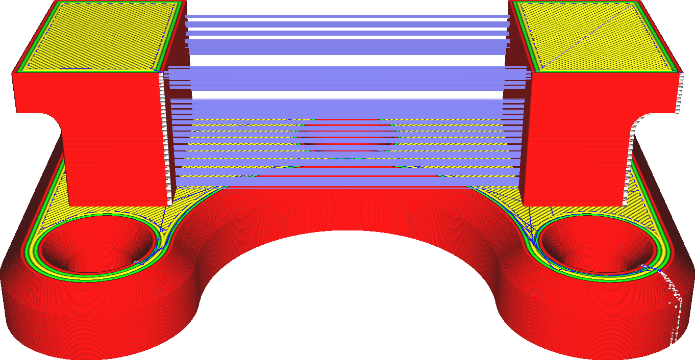

Einzug aktivieren
====
Wenn ein 3D-Drucker den Materialdruck stoppt, wird das Material nicht sofort aufhören, aus dem Ende der Düse zu fließen. Es verbleibt ein Restmaterial in der Düse, das unter Druck steht und daher noch eine Weile weiterfließt. Um den Materialfluss wirklich zu stoppen, muss der Drucker das Material aus der Düsenöffnung einziehen. Dies ist notwendig, um saubere Fahrwege ohne Stringing zu ermöglichen.

<!--screenshot {
"image_path": "retraction_enable_disabled.png",
"models": [{"script": "wire_mount.scad"}],
"camera_position": [0, -115, 68],
"structures": ["travels", "helpers", "shell", "infill", "starts"],
"settings": {"retraction_enable": false},
"minimum_layer": 2,
"colours": 64
}-->
<!--screenshot {
"image_path": "retraction_enable_enabled.png",
"models": [{"script": "wire_mount.scad"}],
"camera_position": [0, -115, 68],
"structures": ["travels", "helpers", "shell", "infill", "starts"],
"settings": {"retraction_enable": true},
"minimum_layer": 2,
"colours": 64
}-->

Das Einziehen erfolgt bei Fahrwegen, die besonders empfindlich auf Stringing reagieren. Fahrwege, die nur durch die Füllung verlaufen oder von Support zu Support führen, werden normalerweise nicht eingezogen. Es gibt auch eine Grenze dafür, wie oft das Material eingezogen werden darf, und zwar durch die Einstellungen [Maximale Anzahl von Einzügen](retraction_count_max.md) und [Fenster „Minimaler Extrusionsabstand“](retraction_extrusion_window.md).

Das Einziehen hat erhebliche Vorteile, aber auch einige Nachteile:
* Es reduziert das Stringing erheblich. Keine Fäden mehr zwischen verschiedenen Teilen des Drucks.
* Die Menge und Größe der Blobs auf der Oberfläche, wo die Düse in den Umfang eines Teils eintritt, wird erheblich reduziert.
* Das Einziehen dauert etwas länger.
* Der Materialfluss wird beim Einziehen unterbrochen. Dies hat negative Auswirkungen auf die Maßgenauigkeit, die Streifenbildung und die Unterextrusion.
* Das Filament kann sich durch zu häufiges Einziehen abnutzen, so dass der Feeder das Material nicht mehr fassen kann.

**Flexible Materialien lassen sich schwerer einziehen, da sich das Filament durch Ziehen dehnt, anstatt es aus der Düse zu ziehen. Es kann sehr zeitaufwendig und relativ ineffektiv sein, bei solchen Materialien das Einziehen zu ermöglichen.**