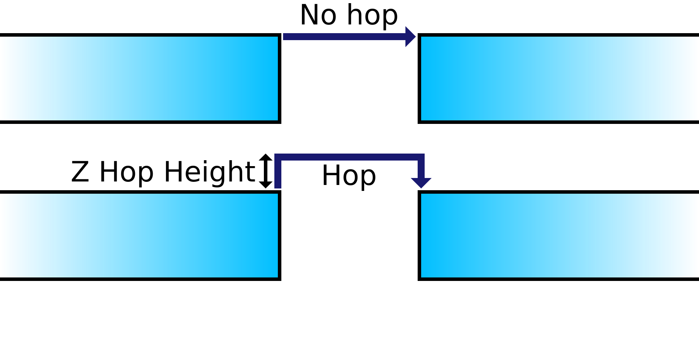

Z-Sprung Höhe
====
Wenn ein Z-Sprung durchgeführt wird, bestimmt diese Einstellung, wie weit sich die Düse nach oben bewegt, bevor sie zum Ziel fährt.

Da die Z-Geschwindigkeit um bis zu 2 Größenordnungen langsamer ist als die X/Y-Geschwindigkeit, können Z-Sprünge zeitaufwendig sein.

Höhere Z-Sprünge nehmen mehr Zeit in Anspruch, was die Gesamtdruckzeit erheblich verlängern kann und auch die Tropfenbildung leicht erhöht,
Wenn man jedoch zu tief über die Oberfläche fährt, kann das austretende Material den Druck trotzdem treffen, was den Zweck des Z-Sprungs zunichte macht.
