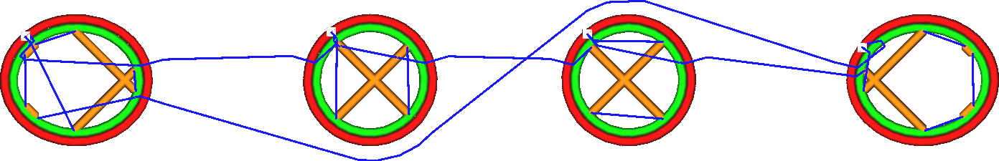

Gedruckte Teile bei Bewegung umgehen
====
Wenn Sie diese Einstellung aktivieren, vermeidet der Druckkopf bei seiner Bewegung durch das Bauvolumen die Berührung anderer Objekte. Stattdessen wird er einen kleinen Umweg nehmen. Wenn ein Umweg möglich ist, bei dem er keine anderen Objekte trifft, wird nicht eingezogen, es sei denn, die Länge des Weges überschreitet die Einstellung [Max Combingentfernung ohne Einziehen](retraction_combing_max_distance.md).

<!--screenshot {
"image_path": "travel_avoid_other_parts_disabled.png",
"models": [{"script": "spike_curve.scad"}],
"camera_position": [0, 0, 116],
"structures": ["travels", "helpers", "shell", "infill", "starts"],
"settings": {
    "retraction_enable": false,
    "travel_avoid_other_parts": false
},
"minimum_layer": 549,
"layer": 550,
"colours": 64
}-->
<!--screenshot {
"image_path": "travel_avoid_other_parts_enabled.png",
"models": [{"script": "spike_curve.scad"}],
"camera_position": [0, 0, 116],
"structures": ["travels", "helpers", "shell", "infill", "starts"],
"settings": {
    "retraction_enable": false,
    "travel_avoid_other_parts": true
},
"minimum_layer": 549,
"layer": 550,
"colours": 64
}-->

Abgesehen davon, dass sie andere Teile meiden, versuchen die Fahrwege auch, so kurz wie möglich in der Nähe der Wände zu bleiben. Das bedeutet, dass die Düse beim Austritt aus oder Eintritt in ein Teil durch eine Wand senkrecht zur Wand austritt oder eintritt.

Diese Einstellung verbessert tendenziell die Oberflächenqualität des Drucks, da die Düse nicht so oft durch die Wände fährt. Das Durchqueren von Wänden hinterlässt eine Kratzer in der Wand, was vermieden werden sollte.

Allerdings erhöht diese Einstellung die Menge des Tropfens, da mehr Fahrwege ohne Einziehen gemacht werden und die Fahrwege länger sind. Bei Materialien, die stark tropfen, kann es ratsam sein, das Umgehen anderer Teile zu deaktivieren.

Die Druckzeit kann sich durch die längeren Fahrwege geringfügig verlängern, doch wird dies in der Regel durch die dadurch bedingte geringere Anzahl von Einzügen vollständig ausgeglichen.