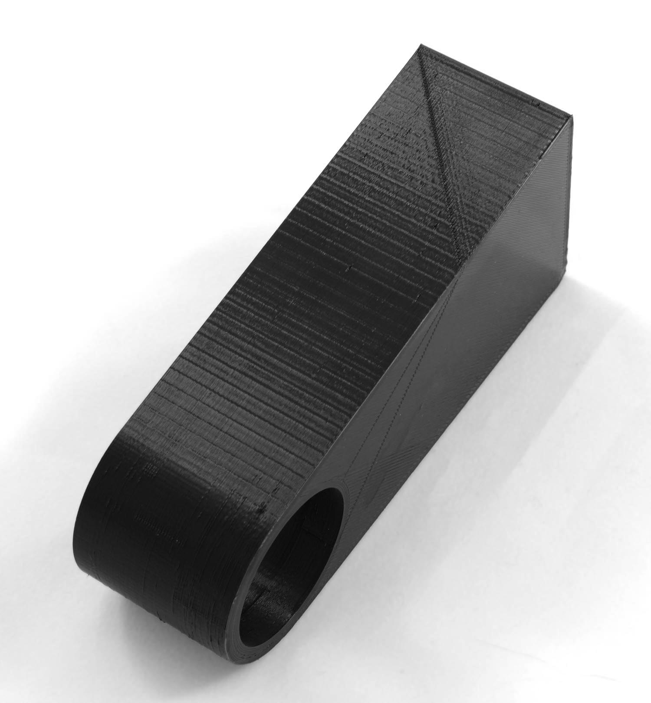

Aliasing
====
Schrittmotoren drehen sich in Einzelschritten. Ihre Fähigkeit, in einer Position zwischen diesen Schritten zu verharren, ist begrenzt. Die Schrittgröße der Motoren stellt eine Grenze für die Auflösung dar, die der Drucker erreichen kann. Beim Drucken von Wänden, die fast, aber nicht ganz an der X- oder Y-Achse ausgerichtet sind, zeigt sich diese Auflösung manchmal als ein Muster von Linien.

Die Auflösung eines Schrittmotors in einem typischen 3D-Drucker für Endverbraucher liegt im Bereich von 50 bis 200 Schritten pro Millimeter. Damit liegt die Größe jedes Schritts bei etwa 10 Mikrometern. Wenn eine Linie fast parallel zur anderen Achse gezogen wird, z. B. 0,5° von der Orthogonalen entfernt, dann tritt ein solcher Schritt alle 1,15 mm entlang der Linie auf. Diese Stufe selbst ist zu klein, um sichtbar zu sein, aber die Schwingungen sind sichtbar, insbesondere wenn sie mit der Eigenfrequenz des Rahmens mitschwingen.

Maßnahmen zur Prävention
----
Schrittmotoren können zwischen verschiedenen Strategien wählen, um ihre Welle zu drehen, aber es ist ein Kompromiss zwischen Auflösung, Drehmoment und Geräusch. Manche Firmware stellt dies automatisch auf der Grundlage der Bewegungsgeschwindigkeit ein. Manche Firmware erlaubt es Ihnen, dies auch über den G-Code einzustellen. Zum Beispiel kann der g-code Befehl `M350` im Start g-code platziert werden, um dies manuell zu konfigurieren. Cura hat (derzeit) keine Methode, dies automatisch auf der Grundlage der Geschwindigkeit oder der Struktur zu konfigurieren.

Der zuverlässigste Weg, dieses Phänomen zu verhindern, ist jedoch, das Modell so einzustellen, dass das Aliasing nicht sichtbar ist. Drehen Sie Ihr Modell so, dass der Aliasing-Effekt nicht auftritt. Wenn Ihr Modell eine (fast) gerade Wand aufweist, stellen Sie sicher, dass diese entweder vollständig mit den Achsen ausgerichtet oder um einige Grad von ihnen abgewinkelt ist.