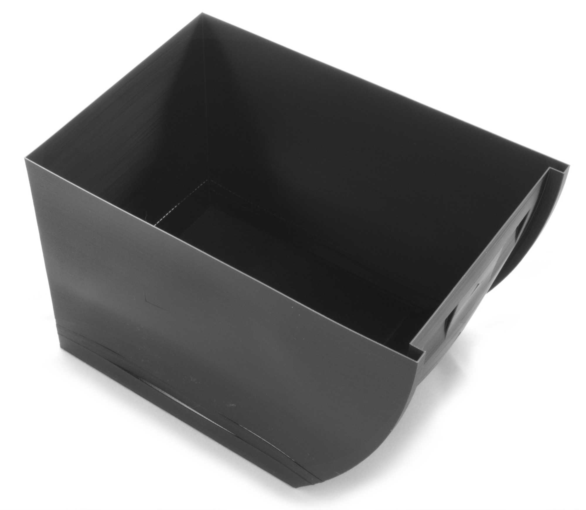

Layer Splitting
====
Die Haftung zwischen den Schichten ist oft die größte Schwachstelle in der Struktur von 3D-gedruckten Objekten. Wenn die Haftung zwischen den Schichten während oder kurz nach dem Drucken versagt, spricht man von Layer Splitting, Schichtspaltungen oder Delamination.

Es kann schwierig sein, mit Schichtspaltungen umzugehen, da sich der Druck immer an der schwächsten Stelle spaltet. Die folgenden Vorschläge zielen darauf ab, den Druck konsistenter und die Extrusion zuverlässiger zu machen, um Schwachstellen in der Haftung der Schichten zu beseitigen.

Warping
----
Die meisten Schichtspaltungen werden durch [Warping](warping.md) verursacht. Dies ist besonders häufig bei teilkristallinen Polymeren der Fall. Diese bilden beim Abkühlen mikroskopische Kristallstrukturen aus und schrumpfen stark. Die häufigste Form des Warping besteht darin, dass sich der untere Teil des Drucks nach oben verzieht, was nicht zu einer Aufspaltung der Schichten führt. Wenn die Verformung jedoch weiter oben im Druck stattfindet, führt sie dazu, dass sich die Schichten von den benachbarten Schichten wegbiegen und sich aufspalten.

Um Warping in höheren Schichten zu verhindern, kann man einige Dinge tun, um die Wahrscheinlichkeit einer Aufspaltung der Schicht zu verringern:
* Verwenden Sie ein konzentrisches [Unteres/oberes Muster](../top_bottom/top_bottom_pattern.md). Ein lineares Muster hat Linien, die alle in dieselbe Richtung schrumpfen, was die Schichten in dieselbe Richtung zieht. Das konzentrische Muster verteilt diese Kraft.
* Die Erhöhung der [Temperatur der Druckabmessung](../material/build_volume_temperature.md) verringert die Verformung durch [Aushärtung](https://en.wikipedia.org/wiki/Annealing_%28glass%29) des Kunststoffs. Dazu benötigt der Drucker ein geschlossenes Bauvolumen, in dem die Wärme gehalten wird.
* Auch die Verwendung eines [Windschutzes](../experimental/draft_shield_enabled.md) hält einen Teil der Wärme im Inneren, wenn auch weniger effektiv als ein geschlossenes Bauvolumen.
* Verhindern Sie scharfe Ecken im 3D-Modell. Das Hinzufügen einer Rundung an einer scharfen Ecke verhindert, dass die Linien der Außenhaut direkt an die darunter liegenden Wände stoßen. Dies ist oft eine Stelle, an der die Schicht aufgespalten wird.
* Verwenden Sie ein Material, das nicht so stark schrumpft. PLA zum Beispiel verzieht sich weniger als Polypropylen. Die meisten Menschen wählen ihr Material jedoch nach bestimmten Anforderungen aus, so dass dies für sie nicht in Frage kommt.

Unzureichender Druck
----
Damit die Schichten gut aneinander haften, ist es hilfreich, den Kunststoff stark auf die vorherige Schicht zu drücken. Wenn die Düse nicht genug Material ausstößt oder das Material nicht stark genug gegen die vorherige Schicht gedrückt wird, verringert sich die Haftkraft zwischen den Schichten, so dass sie sich leichter trennen können. Auch wenn dies nicht sofort zu einem Riss in der Schicht führt, verringert sich dadurch die Festigkeit des fertigen Teils.

Dies ist vor allem ein Problem für die Wände. Die Außenhaut hat eine so große Oberfläche, die nicht zum Reißen neigt. Zwischen Füllung und Wänden sorgen die Wände für den größten Teil der Schichthaftung, da die Füllung oft sehr schnell gedruckt wird, mit spärlich verteilten Linien und oft nicht vertikal gestapelt.

Um einen ausreichenden Druck zu gewährleisten, muss sichergestellt werden, dass keine [Unterextrusion](underextrusion.md) vorliegt. Es gibt alle Ursachen für Unterextrusion, aber einige davon sind für das Layer Splitting von besonderer Bedeutung:
* Wenn man den Druck auf halber Strecke unterbricht, dauert es eine Weile, bis die Extrusion wieder in Gang kommt. Das "Skript Pause at Height" hat eine Option, um <!--if cura_version >= 4.7-->eine Schicht zu wiederholen<!--endif--><!--if cura_version < 4.7:die letzten Schichten zu wiederholen-->. Dadurch wird das Material vorbereitet, bevor es nach oben weitergeht, und eine schwache Schicht mit unzureichendem Düsendruck verhindert.
* Wenn Sie die [Wanddruckgeschwindigkeit](../speed/speed_wall.md) verringern, werden die Wände gleichmäßiger gedruckt. Dies verringert die Wahrscheinlichkeit der Entstehung von Schwachstellen und reduziert gleichzeitig die Unterextrusion an den Wänden.
* Verringern Sie die [Schichthöhe](../resolution/layer_height.md) oder die [Breite der Wandlinien](../resolution/wall_line_width.md). Hohe Durchflussraten erfordern einen höheren Druck. Ist der Drucker nicht in der Lage, diesen Druck zu erzeugen, wird nicht genügend Material extrudiert, um die dicken Schichten oder breiten Linien zu füllen. Dadurch wird der Druck schwächer.
* Erhöhen Sie die [Drucktemperatur](../material/material_print_temperature.md), um sicherzustellen, dass das Material breiter ausfließt und die Kontaktfläche vollständig ausnutzt, anstatt in der Mitte der Linie konzentriert zu bleiben.
* Reduzieren Sie die [Einzugsabstand](../travel/retraction_amount.md). Lange Rückzugswege lassen mehr Material während des Rückzugs austreten, was später zu Unterextrusion führt. Außerdem unterbrechen sie den Fluss stärker. Es dauert dann länger, bis sich der Fluss wieder stabilisiert. Eine Verringerung der Rückzugslänge verringert die Gefahr, dass sich entlang der Höhe des Drucks eine schwache Verbindung aufgrund eines uneinheitlichen Flusses bildet.

Unzureichende Oberfläche
----
Die Haftung zwischen den Schichten ist eine Abhängigkeit von der Stärke der Bindung zwischen den Materialien, multipliziert mit der Größe der Oberfläche, an die gebunden werden kann. Je größer die Oberfläche ist, desto geringer ist die Wahrscheinlichkeit, dass sich die Schichten aufspalten.

Der wichtigste Parameter hierfür ist die [Wanddicke](../shell/wall_thickness.md). Mehr Wände vergrößern die Oberfläche drastisch. Die Wände werden langsamer gedruckt und befinden sich an dem Punkt, an dem die Spaltung beginnt; sie sind also ein sehr effektives Mittel, um die Haftung der Schichten zu erhöhen. Das Drucken von mehr Wänden erhöht jedoch auch drastisch die Druckzeit und den Materialverbrauch.

Eine unzureichende Oberfläche ist oft ein Problem, wenn große Drucke mit nur einer Wand und ohne Füllung gedruckt werden, bei denen die Verformung stark ist. Die Wand beginnt sich aufgrund der Verformung zu wölben, und es gibt keine Möglichkeit, dies zu verhindern. Dies könnte ein Grund sein, die Verwendung des [Spiralisieren](../blackmagic/magic_spiralize.md) zu deaktivieren, da dieser nur eine einzige Wand druckt und die Erzeugung von Füllung verhindert. Stattdessen müssen Sie möglicherweise mit zwei Wänden drucken und die Dichte der Füllung manuell auf 0% setzen, um einen ähnlichen Effekt zu erzielen.

Unverträgliche Materialien
----
Bei Drucken mit verschiedenen Kunststoffen ist darauf zu achten, dass die Kunststoffe aneinander haften. Kunststoffe mit sehr unterschiedlichen Schrumpfungsverhältnissen können in der Regel nicht aneinander haften. Unterschiedliche chemische Effekte führen auch dazu, dass sich die Kunststoffe gegenseitig abstoßen und nicht aneinander haften. Wenn dies in einem großen flachen Bereich in der Mitte Ihres Drucks geschieht, besteht die Gefahr, dass der Druck dort auseinanderfällt.

Um dies zu verhindern, kann es notwendig sein, eine mechanische Verriegelung zwischen den beiden Oberflächen zu konstruieren. Behandeln Sie die verschiedenen Materialien so, als ob sie separat gedruckt würden, nur dass sie später nicht zusammengefügt werden müssen.