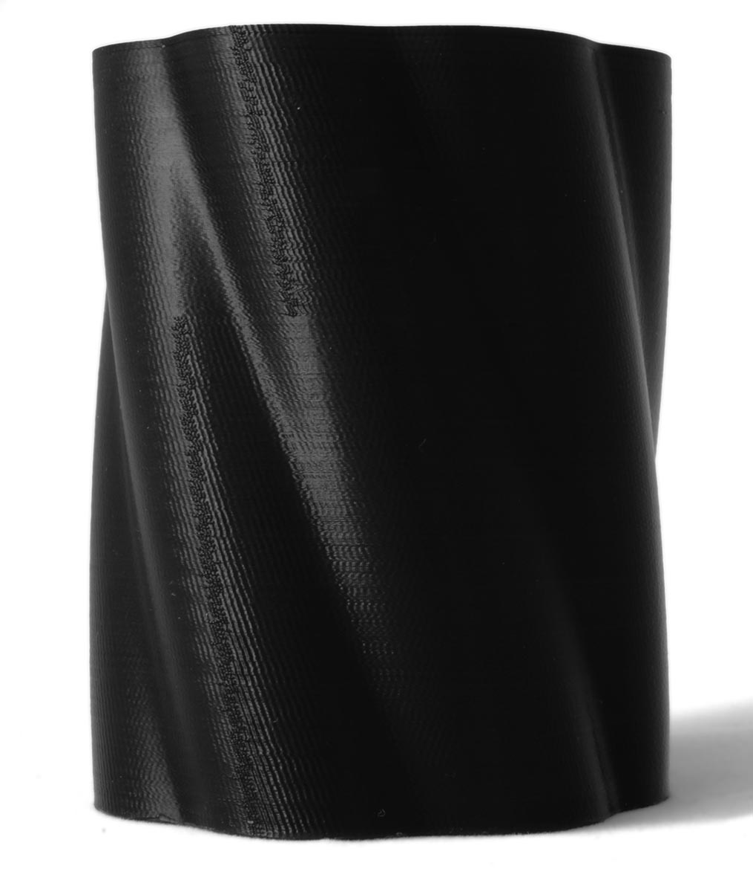

Nähte
====
Die Wände Ihres Drucks werden als fortlaufende Schleifen gedruckt, aber der Drucker muss diese Schleife irgendwo beginnen und sie gut schließen. Wenn die Schleife nicht gut geschlossen ist, entsteht eine sichtbare Naht. Diese Nähte lassen sich nur schwer vollständig entfernen, aber man kann einiges tun, um sie zu verbergen oder ihre Größe zu verringern.

Dies ist nicht zu verwechseln mit einer "Z-Naht", einer Naht, die entsteht, während sich die Düse auf die Höhe der nächsten Schicht bewegt. Diese Bewegung hält die Düse für einen kurzen Moment an und erzeugt dort einen [blob](blobs.md). Curas Terminologie bei den Nahteinstellungen ist in dieser Hinsicht historisch falsch, da es bei den sogenannten "Z-Naht"-Einstellungen eigentlich darum geht, wo die normale Naht platziert werden soll.

Platzierung der Nähte
----
Nähte sind schwer zu verhindern, aber es ist oft ziemlich einfach, die Naht an einer Stelle zu verstecken, wo sie nicht so sichtbar ist.

Die wichtigste Einstellung für die Platzierung der Naht ist die [Justierung der Z-Naht](../shell/z_seam_type.md). Um die Naht zu verbergen, platzieren Sie sie innerhalb der schärfsten Ecke. Mit der Einstellung [Präferenz Nahtkante](../shell/z_seam_corner.md) können Sie dann wählen, welche Art von Ecke ausgewählt werden soll. Um die Naht zu verbergen, wählen Sie vorzugsweise "Naht verbergen" oder "Intelligent verbergen", wodurch die Naht in einer Innenecke platziert wird. Wenn Ihr Modell keine Innenecken zum verbergen hat, können Sie "Naht offenlegen" wählen, um die Naht an einer scharfen Außenecke zu platzieren, wo sie auch weniger sichtbar ist als auf einer ansonsten flachen Oberfläche.

Wenn die automatische Platzierung nicht gut funktioniert, können Sie die Naht auch selbst platzieren, indem Sie "Benutzerdefiniert" wählen. In diesem Fall können Sie die Koordinaten [X](../shell/z_seam_x.md) und [Y](../shell/z_seam_y.md) eingeben, auf die die Naht ausgerichtet werden soll. Wählen Sie eine Stelle, an der die Naht nicht zu sehen ist.

Wenn alles andere fehlschlägt, können Sie die Naht auch über die gesamte Fläche verteilen, indem Sie "Zufällig" wählen. Anstelle einer durchgehenden Naht, die über das Teil verläuft, wird die Naht an zufälligen Stellen über die Oberfläche verteilt. Die Oberfläche wird etwas pockennarbig sein, aber es gibt keine echte Naht mehr.

Schließen der Naht
----
Die Naht kann auch weniger sichtbar gemacht werden, indem die Naht beim Erstellen sorgfältiger geschlossen wird. Es gibt einige Einstellungen, die die Sichtbarkeit der Naht verringern können.
* Erhöhen Sie den [Wipe-Abstand der Außenwand](../shell/wall_0_wipe_dist.md) leicht. Diese Einstellung bewirkt, dass die Düse ihre Bewegung um die Kontur kurz fortsetzt, nachdem sie eine Schleife abgeschlossen hat. Dadurch wird verhindert, dass eine Lücke entsteht, wenn die Kontur geschlossen ist. Wenn Sie diese Einstellung jedoch zu stark erhöhen, kann dies dazu führen, dass zu viel Material um die Naht herum aufgetragen wird, wodurch diese wieder sichtbar wird.
* Das Gegenteil davon ist die Verwendung von [Coasting](../experimental/coasting_enable.md). Dadurch wird das Extrudieren von Material kurz vor dem Schließen der Kontur gestoppt. Dadurch wird der Druck in der Düse reduziert. Der Gedanke dahinter ist, dass nicht zu viel übermäßig extrudiert wird, wenn die Kontur abgeschlossen ist, wodurch das Hervortreten der Naht nach außen reduziert wird. Sobald sich die Düse über den Beginn der Kontur bewegt, blockiert der zuvor eingebrachte Kunststoff leicht jeden neuen Kunststoff, da der Druck in der Düse nicht in der Lage ist, den Gegendruck der erstarrten Wandlinie zu überwinden.
* Drucken Sie die Außenwand [langsamer](../speed/speed_wall_0.md). Das Material kann dann besser ausfließen, um die Naht am Ende zu schließen.