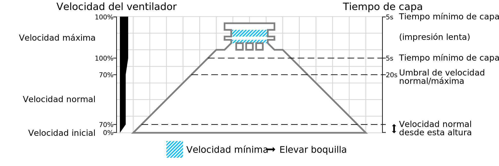

Velocidad mínima
====
Si una capa tarda muy poco tiempo en imprimirse, la velocidad de impresión se reducirá de forma que la capa siga tardando el [Tiempo mínimo de capa](cool_min_layer_time.md) en imprimirse. Sin embargo, no se reducirá por debajo de esta velocidad mínima. Si la impresión de la capa a la velocidad mínima tarda menos que el Tiempo Mínimo de Capa, la impresora esperará al final de la capa hasta que haya pasado el Tiempo Mínimo de Capa.

El cumplimiento del Tiempo Mínimo de Capa es importante para permitir que la capa anterior se solidifique antes de poner la siguiente capa encima. Reducir la velocidad de impresión ayuda, porque los ventiladores del cabezal de impresión pueden soplar el filamento durante más tiempo. Sin embargo, reducir demasiado la velocidad de impresión es perjudicial porque el calor de la boquilla puede extenderse a las capas inferiores y a las paredes adyacentes. Esto puede hacer que la superficie se ensucie mucho y que se produzca un hundimiento localizado. Por eso también hay una velocidad mínima. Al final de la capa, el cabezal de impresión normalmente se moverá un poco hacia arriba (a menos que el ajuste [Lift Head](cool_lift_head.md) esté desactivado), permitiendo que el ventilador sople sobre el filamento un poco más hasta que el tiempo mínimo de la capa haya pasado. La impresora continúa entonces con la siguiente capa.

Por ejemplo, una pieza muy pequeña puede tener alguna capa que tarde 3 segundos en imprimirse a una velocidad normal de 30mm/s, pero el ajuste de Tiempo Mínimo de Capa está establecido en 10 segundos. La impresora reduciría entonces su velocidad a 9mm/s de modo que tardaría exactamente 10 segundos en imprimir esa pieza. Sin embargo, si la velocidad mínima se establece en 10mm/s, entonces la impresora imprimiría esta capa a 10mm/s en su lugar y terminaría después de 9 segundos. Si [Lift Head](cool_lift_head.md) está activado, la impresora esperará 1 segundo al final de la capa antes de comenzar con la siguiente (y en caso contrario continuará inmediatamente sin esperar).