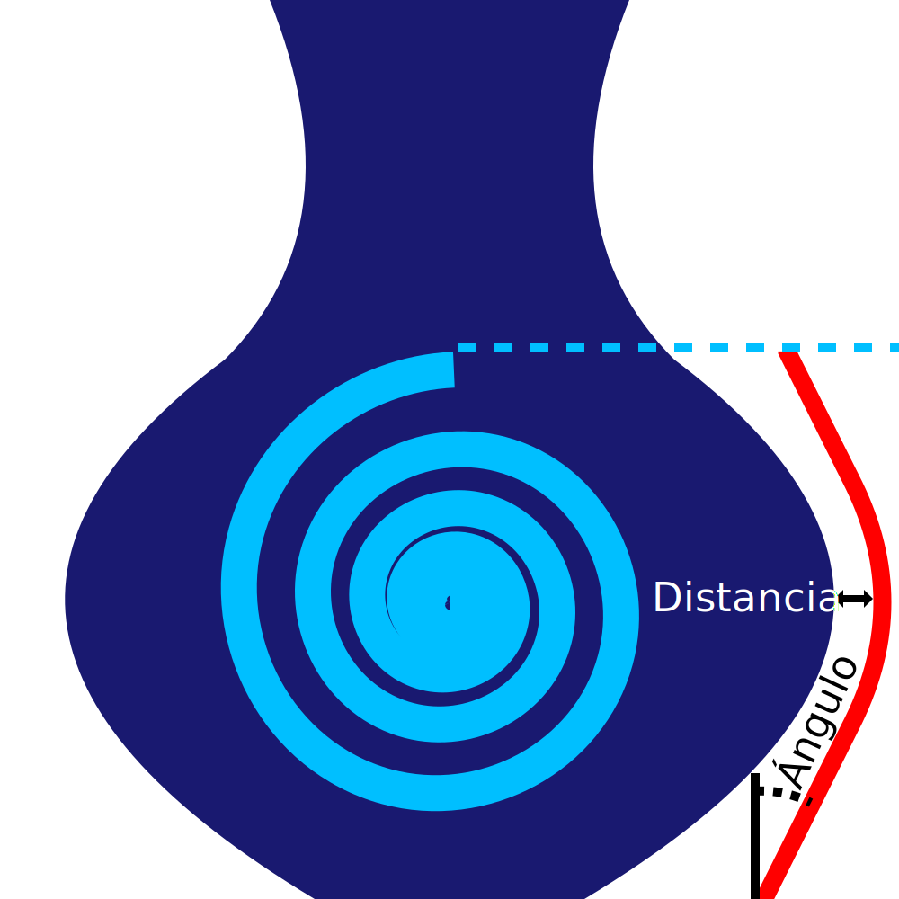

Ángulo del Escudo de Exudado
====
El escudo de exudado seguirá la forma del modelo. Tiene que estar cerca, de lo contrario el viaje del escudo al modelo rezuma nuevo material. Pero el modelo puede tener superficies horizontales, lo que crearía voladizos pronunciados en el escudo antiheladas. Este ajuste limita la inclinación del escudo de exudación para que no se derrumbe.

* Un valor de 0 hace que el escudo de exudado sea completamente vertical alrededor de toda la forma. Cuanto menor sea el ángulo, más estable será el escudo.
* Un valor de 90 hace que el escudo de exudado siga exactamente el modelo. Cuanto más alto sea el ángulo, mejor evitará el escudo de exudado en el modelo.

Mientras que en teoría tendría sentido usar un valor similar al del [Ángulo del soporte] (../support/support_angle.md), el escudo antihielo es sólo una línea. Esta única línea es más débil que su modelo y está más sujeta a la deformación. Es bueno utilizar un ángulo ligeramente más superficial que el que normalmente se imprimiría bien en su modelo, para evitar que el escudo de exudado se parta.