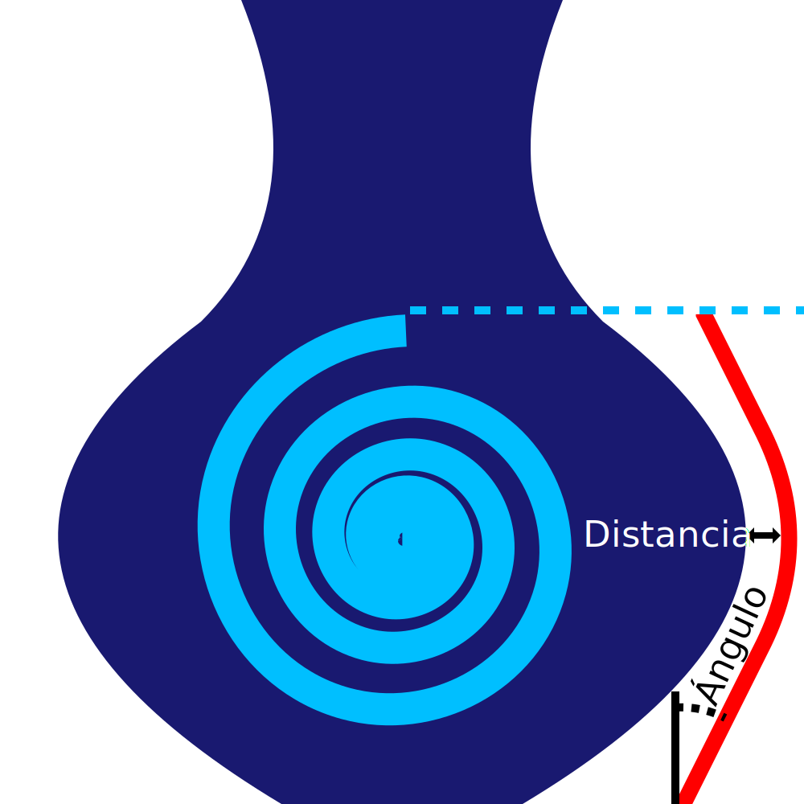

Distancia del Escudo de Exudado
====
Este ajuste determina la distancia que debe mantener el escudo de exudado (como mínimo) con respecto a su objeto. Se debe mantener una pequeña distancia para evitar que el escudo de exudado o las manchas en él se peguen a su modelo.

Coloca el escudo de exudado tan cerca del modelo como sea posible sin golpearlo. Cuanto más cerca esté el escudo del modelo, menos tiempo habrá entre el escudo y el modelo para que la boquilla rezume más.

A veces el escudo tendrá una distancia mayor al modelo, porque el escudo también debe mantener un cierto [ángulo de voladizo](ooze_shield_angle.md) para no colapsar.