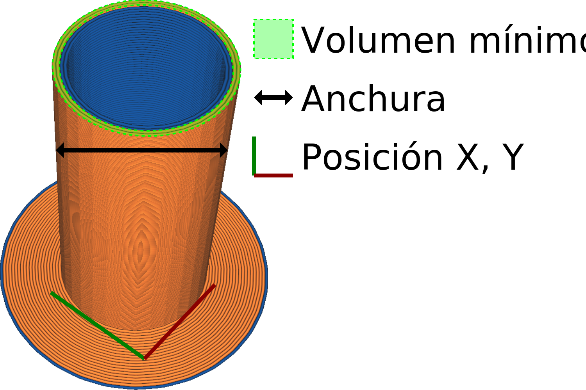

Habilitar la Torre de Purga
====
Esto imprime una torre en su placa de construcción con una mezcla de materiales. La torre está destinada a ser tirada, pero sirve para cebar el material después de cada cambio de extrusor.

Mientras otros extrusores están imprimiendo, una boquilla a veces rezuma algo de material, dejando la cámara de la boquilla vacía de material. El cebado del material después es esencial, o el material no fluirá correctamente todavía al principio.

La torre de purga consiste en una carcasa exterior que se imprime completamente con un extrusor, cada capa. Esto es necesario para garantizar la estabilidad de la torre, pero a veces requerirá interruptores de extrusores adicionales para algunas impresiones. Todos los demás extrusores imprimirán bucles dentro de esta carcasa, vertiendo su material dentro de la torre, preferiblemente a lo largo de las paredes del interior. Estos extrusores no necesitan cebarse si empiezan en la capa, porque no entrarán en modo de espera entonces.

El material que se elige para la capa exterior es el material con la mayor [Tendencia a la adhesión] (../material/material_adhesion_tendency.md). Este es un ajuste oculto que no puede ser alterado desde la interfaz, que indica lo bien que se adhieren las capas. Al elegir el material con mayor adherencia entre capas, se minimiza el riesgo de que la torre de purga se rompa. Si varios materiales tienen la misma tendencia de adhesión (por ejemplo, para impresiones de dos colores utilizando el mismo tipo de material), se elige el número de extrusor más bajo.

Además del cebado, la boquilla también realizará un movimiento dentro de la torre para limpiar el material de la boquilla que se haya acumulado durante la espera. Esto evita que el material se pegue a la impresión. Por ello, la torre de purga también se denomina a veces "torre de limpieza".

Las desventajas de la torre de purga son que se tarda más tiempo en imprimir y que ocupa más espacio en la placa de impresión.