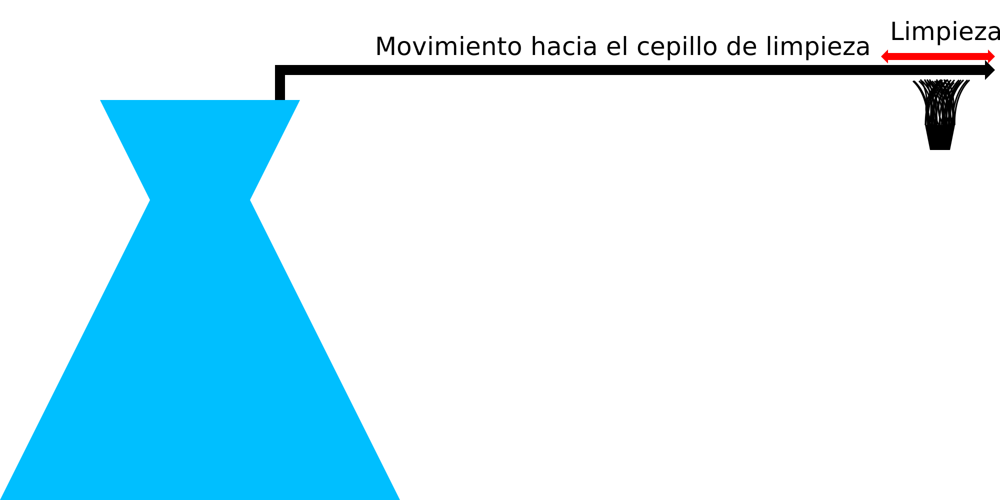

Limpiar tobera entre capas
====
Este ajuste activa un procedimiento que se ejecuta al final de cada capa para limpiar cualquier material de la punta de la boquilla. Si tiene una impresora con un cepillo de limpieza incorporado, la activación de este ajuste hará que Cura ordene a la impresora que limpie periódicamente la boquilla con ese cepillo.

Este procedimiento de limpieza consta de varios pasos:
1. Si [la retracción está activada](wipe_retraction_enable.md), el material se retrae.
2. Si [Z-hop está habilitado](wipe_hop_enable.md), la boquilla se mueve hacia arriba o la placa de construcción hacia abajo.
3. La boquilla se mueve más allá de la [posición del pincel](wipe_brush_pos_x.md).
4. La boquilla se limpia [un número de veces](wipe_repeat_count.md) en el pincel.
5. La boquilla se mueve de nuevo a su posición original.
6. El salto en Z se termina, si estaba activado. El material se desengancha.
7. La impresión se detiene durante un [período determinado] (wipe_pause.md).

El objetivo de este procedimiento es limpiar periódicamente la boquilla de cualquier residuo. Algunos materiales tienden a arrastrarse hasta la boquilla con la acción capilar debido a la alta tensión superficial. Estos materiales pueden introducirse en el cabezal de impresión y acumularse allí, lo que puede romper el cabezal de impresión. Otros materiales que contienen fibras u otros rellenos pueden hacer que el relleno se rocíe en la boquilla durante la impresión. Esto hará que se limpie ese material.

Sin embargo, el procedimiento de limpieza no es muy configurable. Siempre limpia en la dirección X, manteniendo la posición Y de la última posición en la impresión. Esto significa que una impresora con un cepillo en una esquina no va a funcionar bien con esta función. Necesitarías un cepillo a lo largo de todo un lado del volumen de construcción.