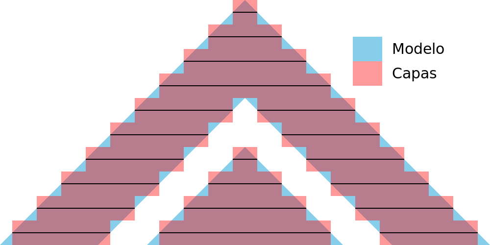
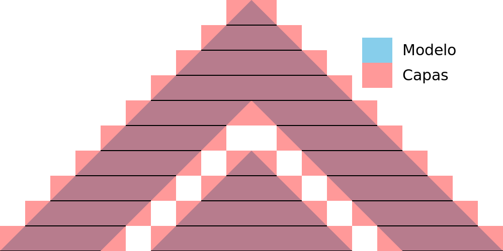
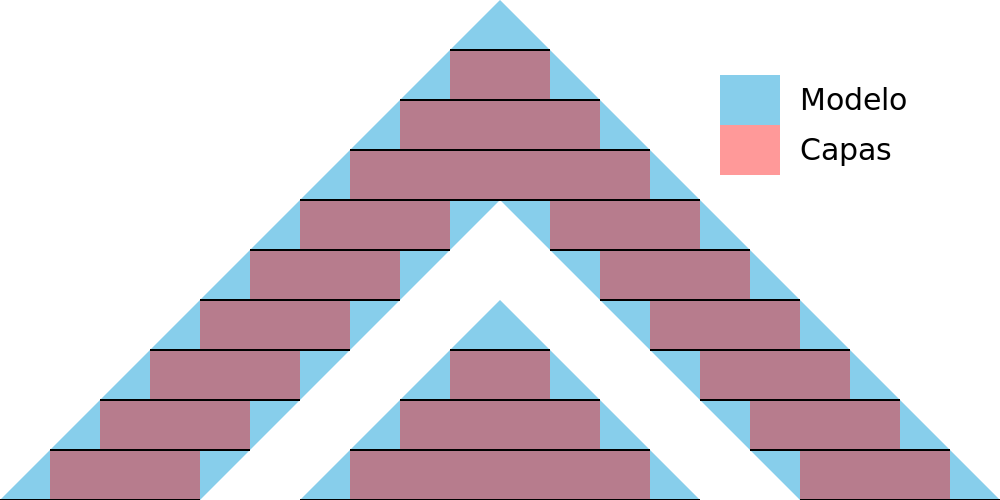

Tolerancia de segmentación
====
Con la tolerancia de segmentación, puede ajustar cómo tratar la inexactitud de la subdivisión de una malla en una cantidad finita de capas. Le permite elegir si las capas deben aproximarse a la superficie, si deben permanecer limitadas por la superficie o si deben incluir la superficie por completo.

Medio
----

Cuando se utiliza Medio, las capas se mantienen lo más cerca posible de la superficie original. Esto significa que las capas a veces sobresalen de la superficie original y a veces se sumergen en la superficie original. En general, el volumen de las capas coincidirá con el volumen de la malla original.

Para obtener la tolerancia media, Cura calculará una sección transversal a medio camino del grosor de cada capa. Todo lo que esté dentro de la sección transversal formará parte de la capa.

Inclusiva
----

Cuando se utiliza Inclusiva, las capas contendrán *al menos* todo el volumen original. Si la superficie está inclinada, las capas sobresaldrán ligeramente. El volumen total de las capas será casi siempre mayor que el volumen de la malla original.

Para obtener la tolerancia de inclusión, Cura calculará secciones transversales en la parte superior e inferior de la altura de cada capa. Todas las superficies que se encuentren en *cualquiera* de esas secciones transversales se considerarán parte de esa capa. Los pequeños detalles que se encuentren entre las dos secciones transversales seguirán siendo ignorados, ya que son más pequeños que la altura de una capa.

Exclusiva
----

Al utilizar Exclusiva, las capas estarán contenidas dentro del volumen original. Si la superficie está inclinada, las capas serán ligeramente más pequeñas que el volumen original. El volumen total de las capas será casi siempre menor que el volumen de la malla original.

Para obtener la tolerancia exclusiva, Cura calculará secciones transversales en la parte superior e inferior de la altura de cada capa. Sólo las superficies que se encuentren en *ambas* secciones transversales se considerarán parte de esa capa.

Uso
----
Este ajuste se llama así por su uso previsto más que por su efecto funcional. Si tiene varias piezas que necesitan deslizarse unas junto a otras, la forma teórica de las capas puede impedir físicamente que se ajusten exactamente. En tal caso, puede establecer este ajuste en Exclusivo para que las capas estén garantizadas para permanecer dentro de los límites del volumen original. Salvo que se produzcan efectos de deformación, pandeo o similares, esto garantizaría que las partes encajan entre sí y pueden deslizarse unas sobre otras.

En realidad, siempre hay otros efectos que lo impiden. En la práctica, este ajuste puede utilizarse para obtener una tolerancia ligeramente mayor o menor entre dos superficies inclinadas, como puede verse en las imágenes anteriores.