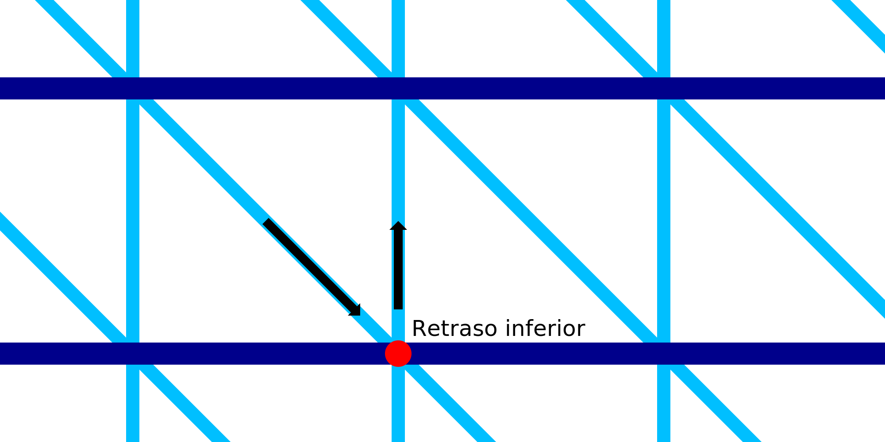

Retardo inferior en IA
====
Con este ajuste, la boquilla se detendrá un momento después de imprimir una línea diagonal hacia abajo.

Mientras la boquilla está parada, seguirá rezumando un poco de material y producirá una mancha allí. Esta mancha ayuda a fijar el patrón de dientes de sierra al anillo horizontal que hay debajo. Esto mejorará la resistencia y la fiabilidad de la impresión.

Sin embargo, la adición de un retraso aumenta considerablemente el tiempo de impresión. Hay muchos lugares donde la boquilla se detendrá entonces.