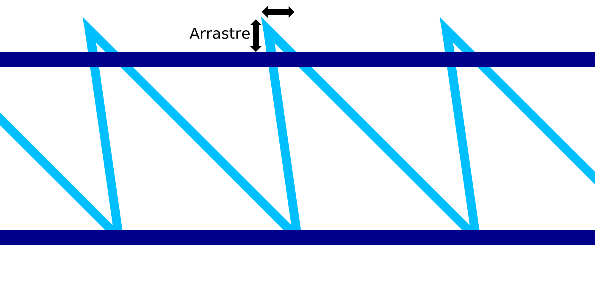

Arrastre en IA
====
Al imprimir el movimiento diagonal descendente del patrón de dientes de sierra para la impresión de alambre, el material tiende a arrastrarse un poco. Este ajuste compensa este efecto transformando ligeramente la forma del patrón de dientes de sierra. Las puntas de los dientes se llevan hacia arriba y hacia atrás.

Las puntas de los dientes se mueven exactamente en sentido contrario al movimiento diagonal hacia abajo. A medida que el material se arrastra, es de esperar que las puntas del patrón de dientes de sierra terminen en su ubicación prevista.

Cuando está bien afinado, esto hace que el patrón de dientes de sierra se imprima con mayor precisión. Como resultado, el siguiente anillo horizontal que se coloca en la parte superior del patrón de dientes de sierra no se hundirá tanto como lo haría de otro modo. Toda la estructura se hace más fuerte y la impresión será más fiable.