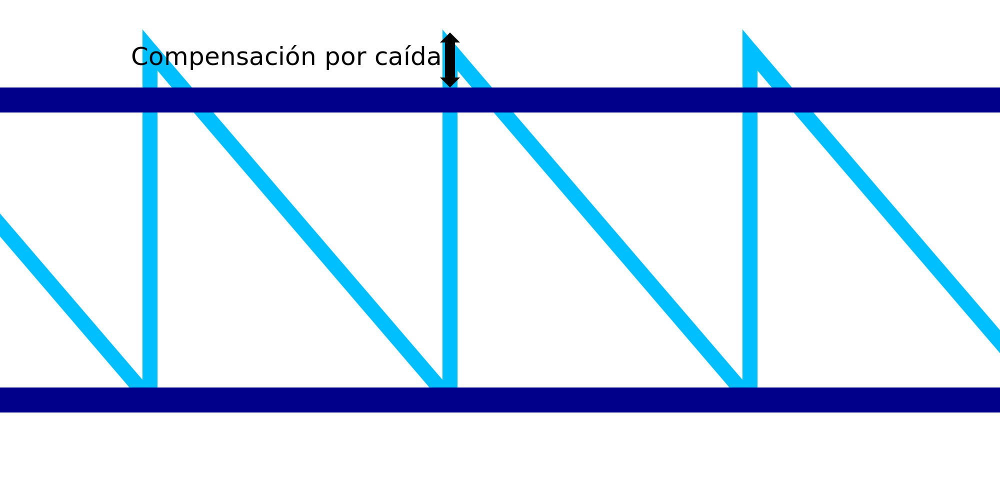

Caída en IA
====
Mientras se imprime el marco de alambre, se espera que el material se hunda debido al calor latente antes de que tenga tiempo de solidificarse. Esto haría que el patrón de dientes de sierra fuera demasiado corto. Mientras que los anillos horizontales son capaces de hacer un puente debido al movimiento horizontal continuo, el patrón de dientes de sierra no puede. Este ajuste compensa la corta estatura del patrón de dientes de sierra, haciendo el patrón ligeramente más alto para que el siguiente anillo horizontal se apoye correctamente en él.

El valor del ajuste se añade a la altura de los dientes de sierra. Con suerte, esto compensa la caída durante la impresión de esos dientes de sierra. Si se ajusta bien, el anillo horizontal se imprimirá descansando firmemente en la parte superior del patrón de dientes de sierra, en lugar de caer por debajo de su altura de impresión prevista.

Cuando se combina con [Arrastrar a lo largo](wireframe_drag_along.md), la altura del patrón de dientes de sierra se convertirá en la [altura] normal (wireframe_height.md) más el valor del ajuste de Arrastrar a lo largo más el valor de este ajuste.