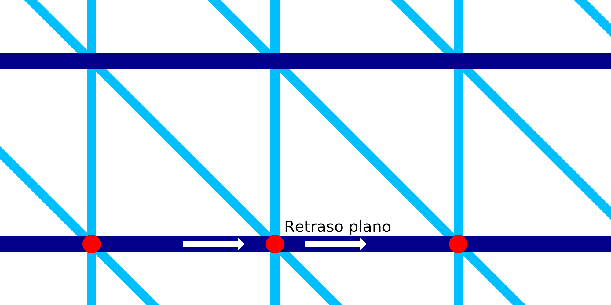

Retardo plano en IA
====
Mientras se imprimen los anillos horizontales del marco de alambre, la boquilla se detendrá durante una fracción de segundo en cada segmento de línea. Este ajuste configura la duración de esa pausa. La pausa se localiza exactamente donde el anillo horizontal se conecta con el patrón de dientes de sierra que hay debajo.

Al detenerse por completo y hacer una pausa, aparecerá una pequeña mancha de material rezumante en los lugares donde se detiene la boquilla. La presión del flujo de material que sale de la cámara de la boquilla también empujará el anillo horizontal ligeramente hacia abajo. Esto hace que el anillo se adhiera mejor al patrón de dientes de sierra que hay debajo.

La pausa se suma al tiempo total de impresión. Hay muchos lugares en los que la boquilla estará en pausa.