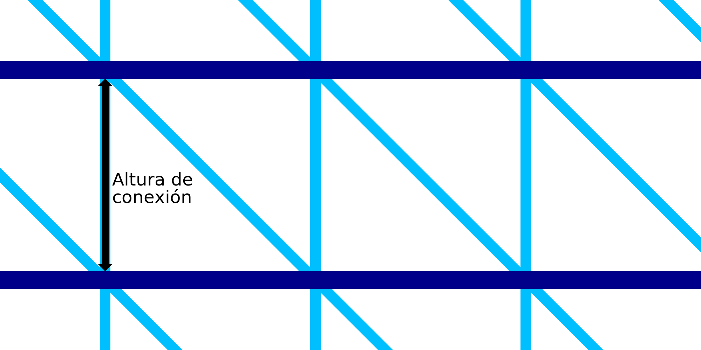

Altura de conexión en IA
====
La impresión de alambre consiste en imprimir un número de anillos alrededor del contorno. El espacio vertical de los anillos está determinado por este ajuste. Con este ajuste se puede definir la longitud de las conexiones entre dos anillos concéntricos.

Los anillos se conectan con un patrón de dientes de sierra. Este consiste en una línea vertical y otra diagonal. La línea vertical tendrá exactamente la longitud de la conexión. La línea diagonal tendrá un ángulo de 45°. Como resultado, este ajuste no sólo determina la altura vertical entre los anillos, sino también el tamaño horizontal del patrón de dientes de sierra. Determinará la densidad del marco en general.

La reducción de la altura hará que el marco sea más denso. Esto hará que el marco sea más estable y que la impresión sea más fiable. Sin embargo, también se necesitará más tiempo para imprimir.