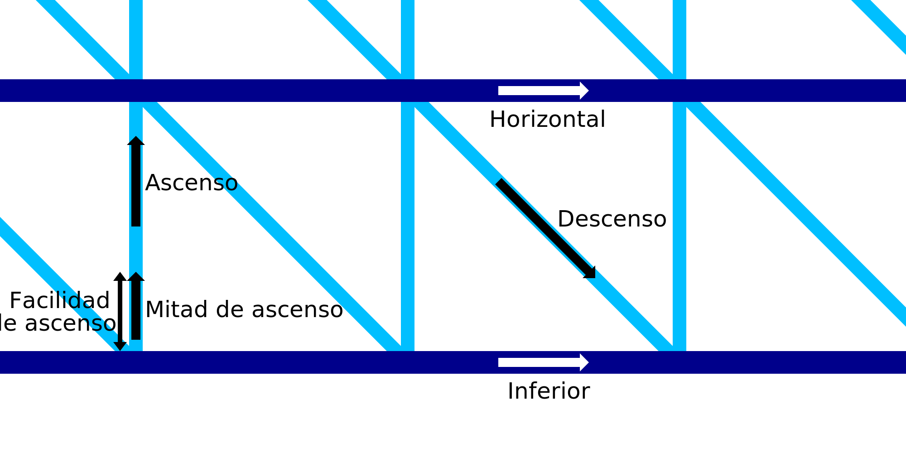

Velocidad de impresión horizontal en IA
====
Este ajuste especifica la velocidad con la que la boquilla se moverá horizontalmente mientras se imprimen los anillos horizontales del marco de alambre. La velocidad de las líneas horizontales puede configurarse por separado del resto de la velocidad de impresión del alambre.

La capa horizontal más baja se imprimirá a la [Velocidad inferior](wireframe_printspeed_bottom.md). Esto puede ser configurado por separado.

La impresión más lenta tomará más tiempo, pero le da al material más tiempo para solidificarse. Esto mejora la capacidad de puenteo del material, lo que hace que la impresión sea más fiable y tenga mejor aspecto al final también.