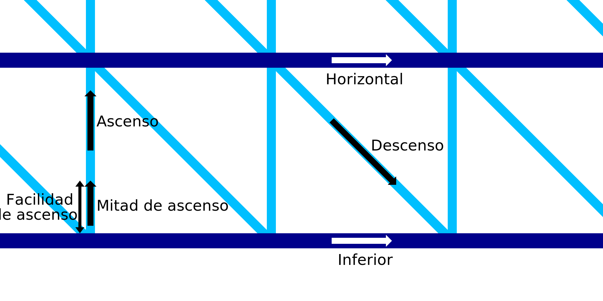

Velocidad de impresión ascendente en IA
====
Este ajuste especifica la velocidad con la que la boquilla se moverá hacia arriba mientras realiza un movimiento vertical en el patrón de dientes de sierra. La velocidad de movimiento hacia arriba puede configurarse por separado del resto de la velocidad de impresión del alambre.

El movimiento ascendente no tendrá la velocidad especificada para todo el movimiento. Para el bit más bajo del movimiento ascendente, definido por el ajuste [Ease Upward](wireframe_up_half_speed.md), el cabezal de impresión se moverá a la mitad de esta velocidad.

Moverse hacia arriba más lentamente tomará más tiempo pero le da al material más tiempo para solidificarse. De esta manera no será arrastrado tanto en la dirección de la diagonal. Sin embargo moverse demasiado lento también empujará la línea hacia abajo debido a la inercia del filamento con la presión en la cámara de la boquilla. El filamento tiende a tambalearse entonces lo que hace menos probable que la siguiente línea horizontal pueda hacer una conexión adecuada.