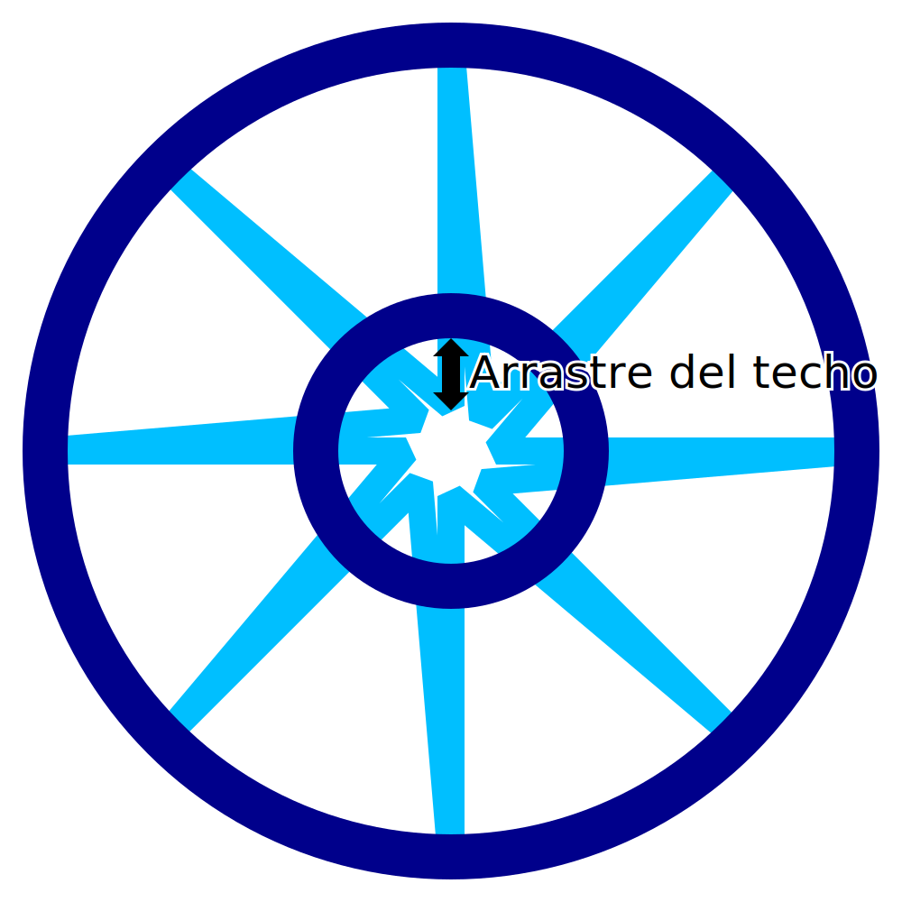

Arrastre del techo en IA
====
Cuando se imprime plástico fundido, la boquilla tiende a arrastrar parte del material con su movimiento incluso después de haber sido extruido. Este efecto es aún más fuerte cuando se imprime en el aire para el techo del marco de alambre cuando se imprime para el modo de impresión de alambre. Este ajuste hace que el patrón de dientes de sierra en la parte superior de la impresión continúe un poco más hacia el interior para compensar el arrastre con la boquilla.

Este ajuste hace que las puntas interiores del patrón de dientes de sierra en la parte superior de la impresión se muevan más hacia adentro. Las puntas se mueven exactamente en la dirección opuesta a las diagonales que se mueven hacia afuera, no a las rectas que se mueven hacia adentro.

Con un ajuste cuidadoso, el objetivo de este ajuste es mejorar la fijación de las puntas interiores del patrón de dientes de sierra al anillo concéntrico que se imprime para que descanse sobre ellas.