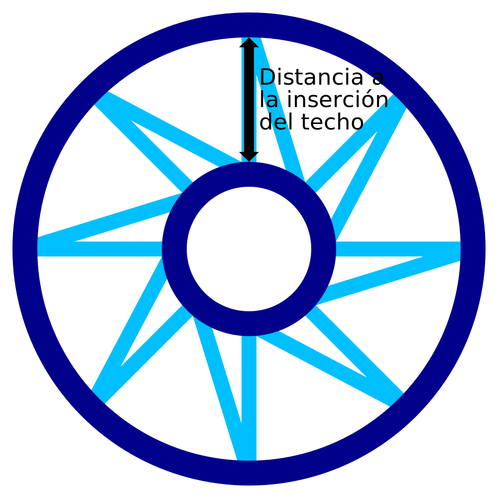

Distancia a la inserción del techo en IA
====
Cuando la superficie del modelo es horizontal, como la parte superior del modelo, se imprimirá una serie de anillos concéntricos conectados con un patrón de dientes de sierra. Este ajuste determina la distancia entre estos anillos concéntricos.

Se dibuja un patrón en forma de diente de sierra entre cada inserción concéntrica. El patrón de dientes de sierra no sólo tendrá la altura indicada por este ajuste, sino también la anchura de la base del patrón de dientes de sierra. La línea diagonal se colocará a una distancia de la base de la línea recta a una distancia indicada por este ajuste en el anillo más interno. Como tal, este ajuste indica la densidad global del patrón del techo, no sólo la distancia entre las inserciones.

Si se reduce este ajuste, las inserciones concéntricas estarán más cerca unas de otras y aumentará la densidad general del patrón. Esto reduce la distancia que el material tiene que salvar al cruzar por la parte superior del modelo. Esto mejora la fiabilidad, aumentando la posibilidad de que se realice una conexión adecuada entre cada una de las inserciones.