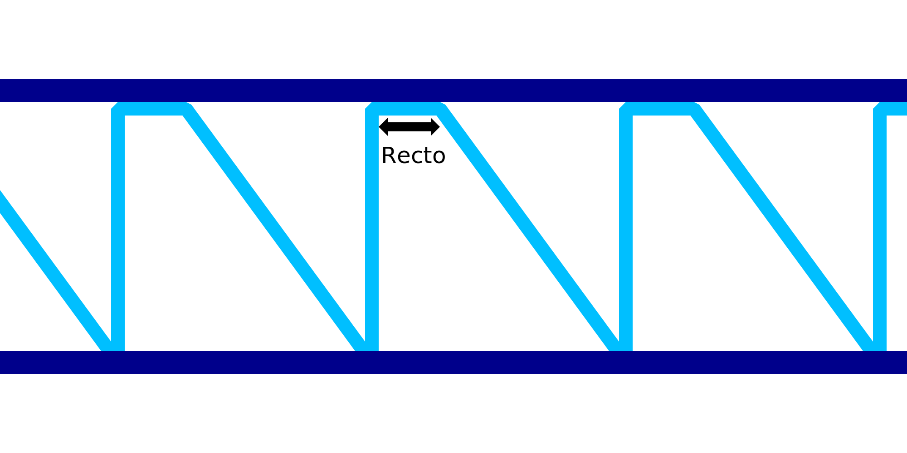

Enderezar líneas descendentes en IA
====
Este ajuste es otro factor de compensación que puede aplicarse para compensar el hundimiento del material durante la impresión del alambre. En lugar de moverse directamente en diagonal hacia abajo para el patrón de dientes de sierra, este ajuste hará que la boquilla vaya en horizontal durante una longitud específica de alambre y luego se mueva hacia abajo.

El movimiento recto horizontal tiene como objetivo tirar del material hacia arriba ligeramente antes de moverse hacia abajo. Si se ajusta correctamente, esto hace que el material baje en una diagonal recta en lugar de en una curva combada. Esto hace que el patrón de dientes de sierra sea más fuerte y también hace que las puntas de los dientes se levanten mejor para soportar el siguiente anillo horizontal.