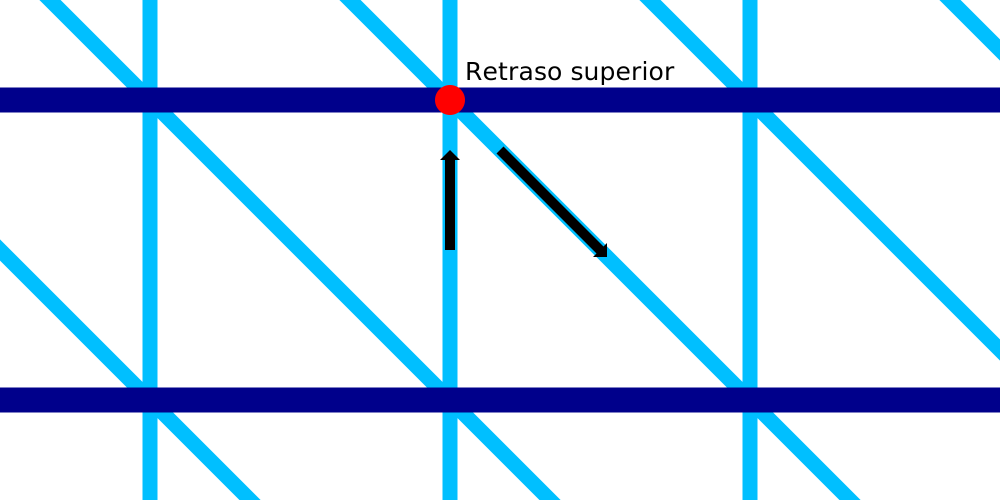

Retardo superior en IA
====
Con este ajuste, la boquilla se detendrá un momento después de imprimir una línea ascendente.

Mientras la boquilla se detiene en la parte superior de la línea ascendente, la línea ascendente tiene algo de tiempo para solidificarse. Esto evita que sea arrastrada junto con la boquilla una vez que comienza a moverse hacia abajo de nuevo.

Por supuesto, este retraso aumenta considerablemente el tiempo de impresión. Mientras está parado, el calor de la boquilla también puede fundir el material y éste rezumará en la parte superior. Esto añade un conglomerado de material fundido en la parte superior de una sola línea de filamento, lo que hace que esa línea sea un poco pesada en la parte superior.

Este ajuste añade un conglomerado de factores a la impresión que son difíciles de predecir. El retardo preciso que funciona mejor para su material, impresora y modelo debe determinarse experimentalmente. En general, aumentar el retraso dentro de lo razonable tiende a tener un impacto positivo en la fiabilidad de la impresión, pero un gran impacto negativo en la velocidad de impresión.