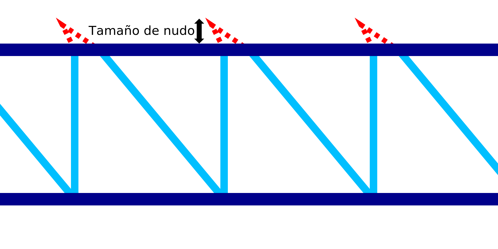

Tamaño del nudo de IA
====
Si la [Estrategia de impresión del alambre](wireframe_strategy.md) está configurada como "Nudo", se realizará un pequeño movimiento hacia arriba y hacia atrás en la parte superior de cada diente de la sierra. Este ajuste configura la magnitud de ese movimiento.

El movimiento para este "nudo" es una serie de movimientos de desplazamiento:
1. Primero, la boquilla se desplazará hacia arriba la distancia indicada por este ajuste. Al mismo tiempo, la boquilla se moverá hacia atrás la mitad de esta distancia.
2. Si hay algún [retardo](wireframe_top_delay.md) en la parte superior, la boquilla hará una pausa por la cantidad de retardo establecida. Esta pausa se realiza en la punta del movimiento del nudo.
3. En tercer lugar, la boquilla volverá a bajar a la altura ordinaria. Al mismo tiempo, la boquilla se moverá hacia adelante 1,5 veces el tamaño del nudo, terminando en la distancia indicada en este ajuste lejos de la línea vertical.

El propósito del nudo es dar al anillo horizontal en la parte superior de la misma un área para unirse al patrón de dientes de sierra. El nudo variará un poco de un lado a otro, por lo que si el anillo horizontal no está colocado con mucha precisión todavía hay más posibilidades de que se adhieran el uno al otro. Además, el nudo hará que la línea ascendente se extienda un poco más hacia arriba, haciendo que el anillo horizontal sea empujado por encima de él. Y por último, el nudo también producirá algún rezago debido a la falta de retracción en este movimiento de desplazamiento. Esto produce una mancha sobre la que el anillo horizontal puede descansar mejor.