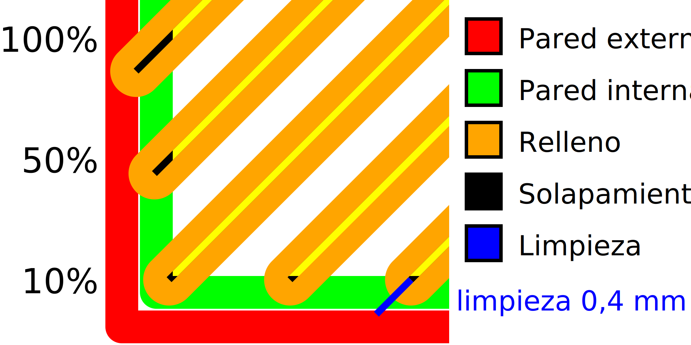

Superposición del relleno
====
Si el relleno se superpone un poco con las paredes, se adherirá mejor a las mismas, haciendo que la pieza sea mucho más resistente. Este ajuste controla cuánto se superpone el relleno con las paredes.

* Aumentar la superposición hace que el relleno se adhiera mejor a las paredes, dando como resultado una pieza más resistente.
* Sin embargo, también hará que el relleno brille a través de las paredes, dando lugar a un patrón en la superficie de la impresión. Esto reduce la calidad visual de la superficie.