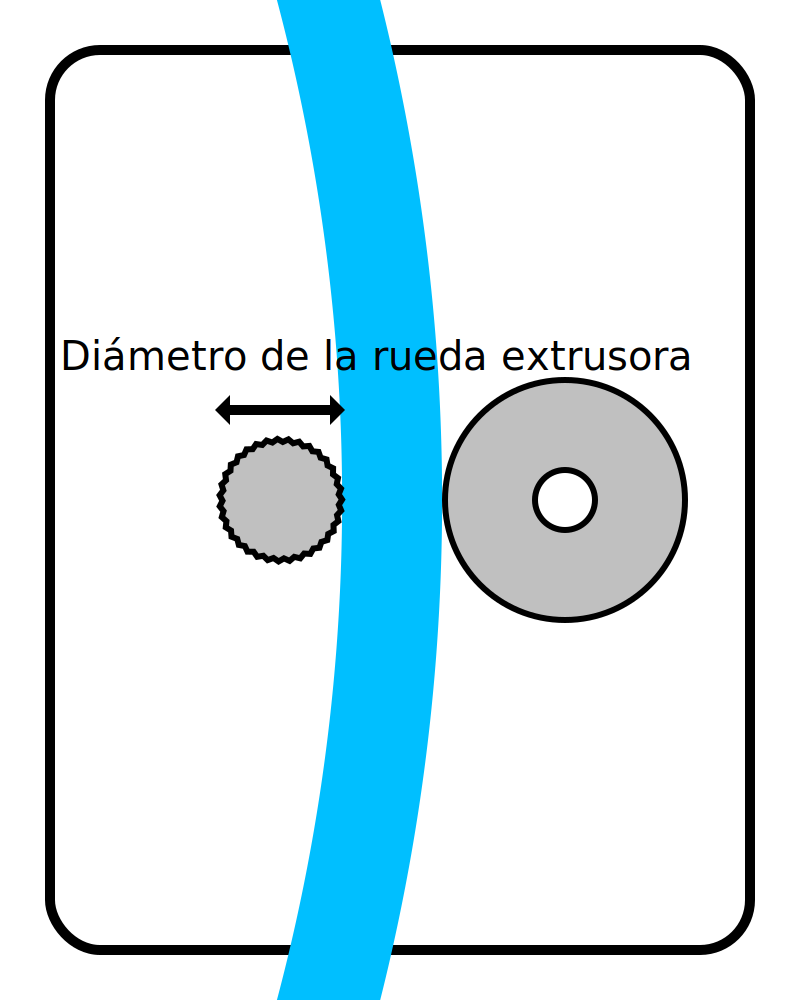

Diámetro de la rueda del alimentador
====
Este ajuste es una medida del diámetro de la rueda que mueve el filamento de un lado a otro dentro del alimentador.

Este ajuste no es utilizado por Cura en absoluto. Sin embargo, es utilizado por el plug-in X3GWriter con el fin de controlar el alimentador correctamente. Necesita saber a qué velocidad mover el alimentador para mover el filamento a la distancia correcta.

**Dado que este es un ajuste de la máquina, este ajuste no es normalmente visible en la lista de ajustes.**