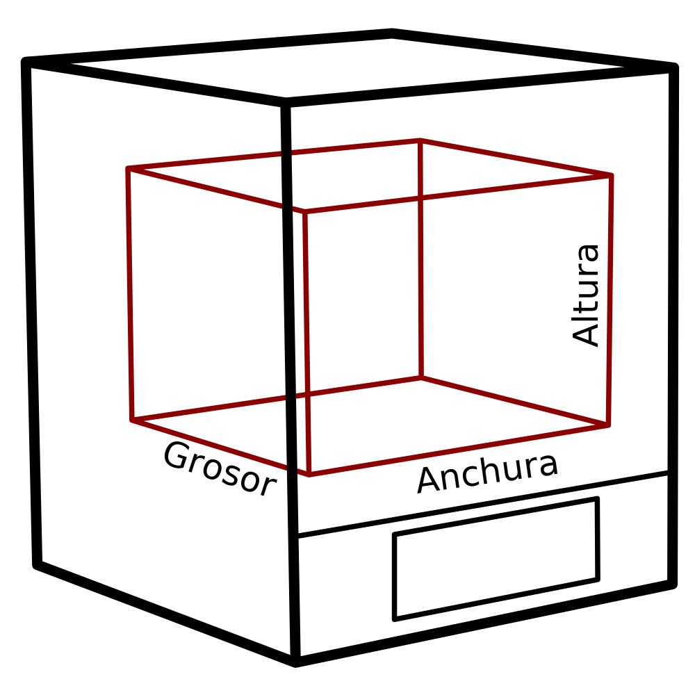

Altura de la máquina
====
Este ajuste indica el rango vertical de coordenadas Z a través del cual la(s) boquilla(s) son capaces de moverse. Es básicamente el tamaño utilizable de la impresora.

Esto no es igual a la altura real de su impresora en el estante. La impresora real también tendrá un pórtico o un brazo y una base alrededor de su volumen de construcción, y esta medida no incluye ese tamaño. Es sólo el tamaño del volumen de construcción, las coordenadas donde la boquilla podría moverse.

**Como este es un ajuste de la máquina, normalmente no aparecerá en la lista normal de ajustes. La altura se puede cambiar en el diálogo de configuración de la impresora, que se puede encontrar en la lista de impresoras añadidas en el diálogo de preferencias.**