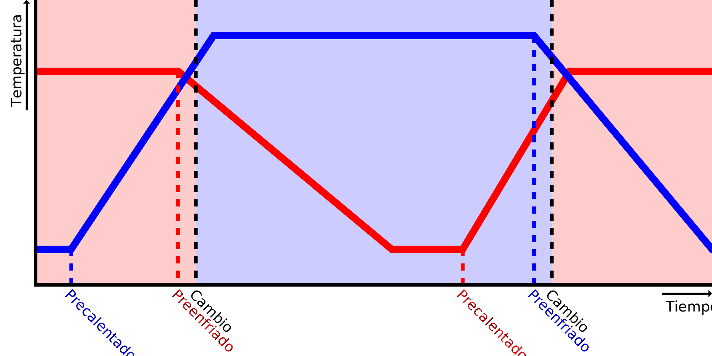

Velocidad de enfriamiento
====
Este ajuste le indica a Cura la velocidad de enfriamiento de la boquilla cuando no se calienta. Se utiliza para predecir cuándo empezar a preenfriar la boquilla antes de cambiar de extrusor.

Al cambiar de extrusor, Cura empezará a preenfriar la boquilla activa justo antes de hacerlo, para que rezume un poco menos mientras espera. Cura también intentará predecir cuánto se ha enfriado la boquilla mientras estaba inactiva. De esta manera sabe cuánto tendrá que calentarla de nuevo después.

Si la boquilla se enfría más rápido de lo que indica este ajuste, la boquilla estará en la temperatura de espera más rápido de lo que predice Cura. Como resultado, puede tardar más tiempo en calentar la boquilla de lo que predice Cura, y la impresora estará esperando en el interruptor de boquillas para que esta boquilla se caliente más.

Si la boquilla se enfría más lentamente de lo que indica este ajuste, la boquilla puede estar aún caliente cuando Cura envíe un comando para precalentar la boquilla, haciendo que se caliente demasiado rápido. Estará a una temperatura de impresión durante un tiempo antes de que sea el turno de la boquilla para imprimir. Durante este tiempo estará rezumando un poco y el plástico se degradará un poco más.

La velocidad real de enfriamiento no es una tasa constante en grados por segundo. Más bien dependerá de la diferencia entre la temperatura actual de la boquilla y la temperatura del volumen de construcción. Por lo tanto, se enfriará más rápido cuando esté caliente, y se enfriará más lentamente a medida que se acerque a la temperatura de reposo. Si estás afinando esto, trata de ajustarlo midiendo el tiempo que tarda en enfriarse desde la [temperatura de impresión final](../material/material_final_print_temperature.md) hasta la [temperatura de espera](../material/material_standby_temperature.md). Esta es la pista más importante que Cura intentará predecir. Cuando se hacen impresiones pequeñas, se puede aumentar la velocidad de enfriamiento ligeramente para ajustar que se mantiene caliente más a menudo.

**Dado que este es un ajuste de la máquina, este ajuste no es normalmente visible en la lista de ajustes.**