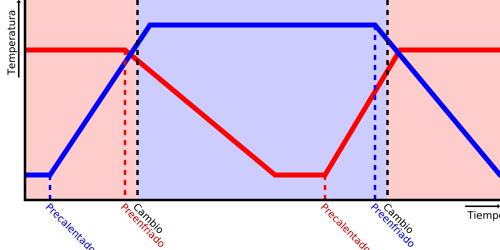

Velocidad de calentamiento
====
Este ajuste le dice a Cura lo rápido que su impresora puede calentar esta boquilla. Se utiliza para predecir cuándo empezar a precalentar la boquilla antes de cambiar de extrusor.

Al cambiar de boquilla, Cura empezará a precalentar la siguiente boquilla antes de que tenga que ser utilizada, para que esté lista para su uso cuando el otro extrusor acabe. Para ello, tomará la diferencia entre la temperatura actual de la boquilla y la temperatura objetivo de la boquilla, y la dividirá por la velocidad de calentamiento, para llegar a una duración para precalentar la boquilla.

Si la boquilla se calienta más rápido de lo que indica este ajuste, la boquilla estará a la temperatura objetivo durante un tiempo antes de que el otro extrusor termine de imprimir. Durante este tiempo rezumará algo de material y el plástico podría degradarse un poco en la boquilla, resultando en una [subextrusión](../troubleshooting/underextrusion.md).

Si la boquilla se calienta más lentamente de lo que indica este ajuste, la impresora tendrá que esperar en el interruptor del extrusor hasta que la boquilla tenga la temperatura deseada para imprimir. Esto llevará algo de tiempo extra. Aparte de eso, el extrusor anterior también se mantendrá a la temperatura final de impresión durante esta espera, lo que hace que rezume más material y degrade el plástico en la boquilla de nuevo. Esto es necesario para evitar que el material se enfríe más de lo que Cura esperaba durante el corte, lo que haría que la diferencia de temperatura fuera mayor de lo que Cura esperaba y, por lo tanto, llevaría a un período de espera aún más largo la próxima vez. Esto llevaría a un efecto de fuga en el que la predicción empeora con cada capa, por lo que Cura necesita mantener el material anterior caliente hasta que se alcance la temperatura de la otra boquilla.

La velocidad real de calentamiento no es una tasa constante en grados por segundo. Más bien dependerá de la diferencia entre la temperatura de la boquilla actual y la temperatura del volumen de construcción. Por lo tanto, se calentará más rápido cuando esté fría, y cuando se acerque a la temperatura objetivo se calentará más lentamente. El regulador PID de la impresora también juega un papel importante en esto. La mayoría de los reguladores ralentizan el calentamiento justo antes de alcanzar la temperatura objetivo para evitar que se sobrepase. Si estás afinando esto, intenta afinarlo midiendo el tiempo que tarda en calentarse desde la [temperatura de espera](../material/material_standby_temperature.md) hasta la [temperatura inicial de impresión](../material/material_initial_print_temperature.md). Esta es la pista más importante que Cura intentará predecir. Cuando se hacen impresiones pequeñas, se puede reducir la velocidad de calentamiento ligeramente para ajustar que no se inicie desde la temperatura de espera, sino desde una temperatura más alta.

**Puesto que se trata de un ajuste de la máquina, este ajuste no suele ser visible en la lista de ajustes.**