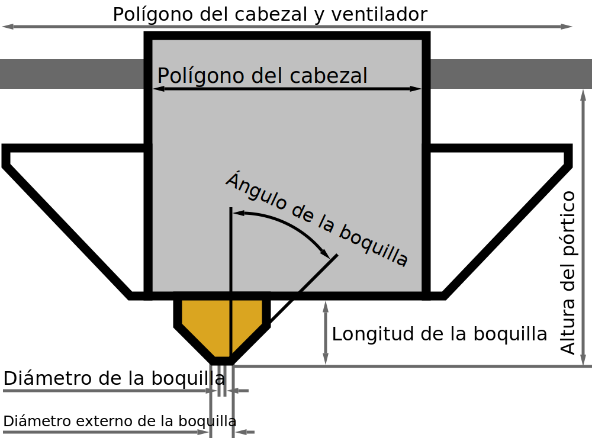

Diámetro de la boquilla exterior
====
Este ajuste describe el diámetro exterior de la punta de la boquilla en su punto más delgado, en la parte inferior.

Otros ajustes pueden utilizar esto para establecer automáticamente algunos valores predeterminados, como el espacio entre las líneas de planchado.

**Como se trata de un ajuste de la máquina, este ajuste no suele ser visible en la lista de ajustes.**