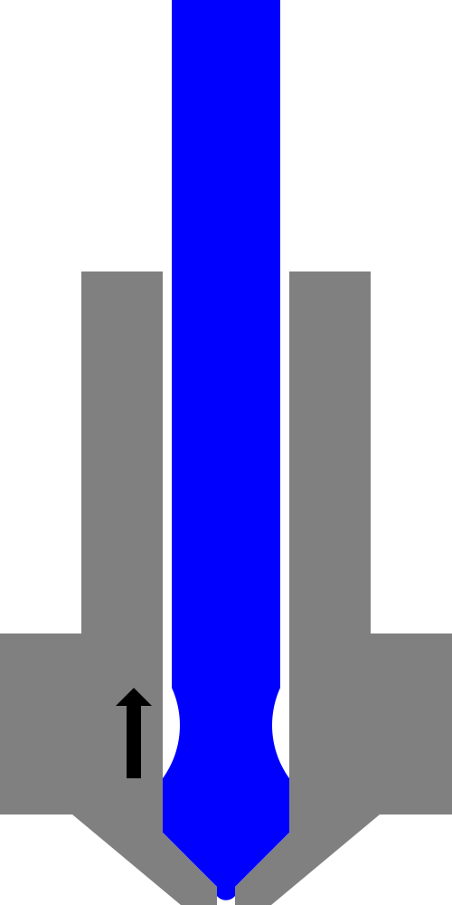

Velocidad de retracción anti-exudación
====
En algunas impresoras, cuando se retrae un material para un cambio de filamento, el material debe romperse limpiamente para poder moverlo a través del alimentador sin que se enrede. Este ajuste configura parte del procedimiento para romperlo limpiamente.

Esta configuración ajusta la velocidad a la que el material se retrae hacia la primera posición para evitar que rezume. El material no se rompe todavía en este punto. El objetivo es únicamente eliminar rápidamente la presión en la cámara de la boquilla tirando de ella hacia dentro.

**Este ajuste no es visible actualmente en la interfaz de Cura. Sólo se puede establecer mediante los perfiles. Tampoco es utilizado por Cura durante el corte. Sin embargo, las impresoras que entienden el formato de archivo de material de Cura pueden utilizarlo para configurar su procedimiento de cambio de filamento correctamente.** A través de un script de post-procesamiento se puede insertar el comando `M600` en la impresión, lo que desencadenará un cambio de filamento.