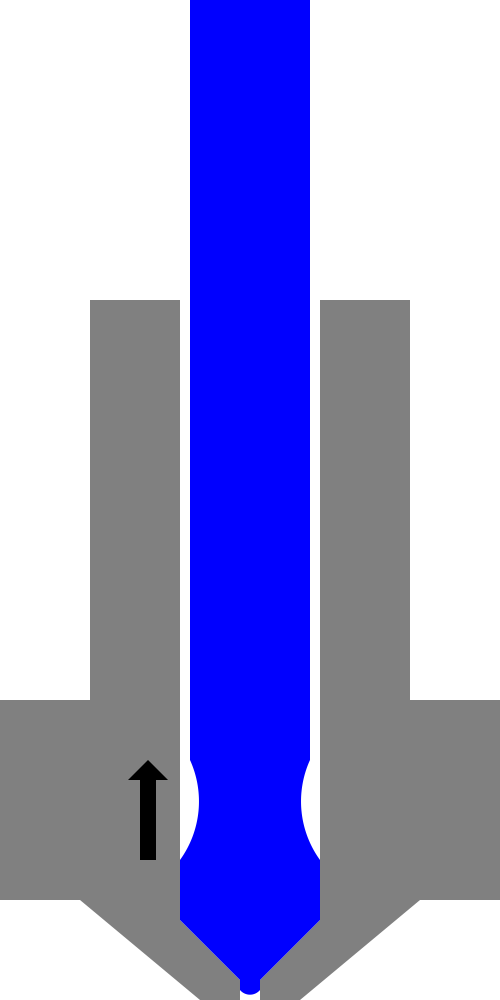

Temperatura de ruptura
====
En algunas impresoras, cuando se retrae un material para un cambio de filamento, el material debe romperse limpiamente para poder moverlo a través del alimentador sin que se enrede. Este ajuste configura parte del procedimiento para romperlo limpiamente.

Esta configuración ajusta la temperatura a la que se debe enfriar antes de romper el filamento. Este enfriamiento se producirá entre la segunda y la tercera etapa (como se muestra en las imágenes de abajo). El objetivo es permitir que el filamento se endurezca, lo que permite a la impresora romperlo limpiamente en lugar de sacarlo en una larga hebra que podría quedar atrapada en el alimentador.

**Este ajuste no es visible actualmente en la interfaz de Cura. Sólo se puede establecer mediante los perfiles. Tampoco es utilizado por Cura durante el corte. Sin embargo, las impresoras que entienden el formato de archivo de material de Cura pueden utilizarlo para configurar su procedimiento de cambio de filamento correctamente.** A través de un script de post-procesamiento se puede insertar el comando `M600` en la impresión, lo que desencadenará un cambio de filamento.