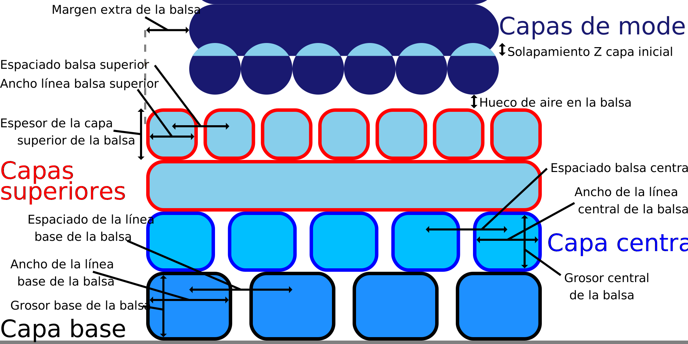

Grosor de la base de la balsa
====
Esta configuración ajusta el grosor vertical de la capa más baja de la balsa.

Similar al ajuste [Altura de la capa inicial](../resolution/layer_height_0.md), aumentar la altura de la capa inicial del raft hace que la boquilla extruya con más fuerza. Esto mejora la adherencia entre la balsa y la placa de construcción. Además, el grosor extra puede capturar cualquier variabilidad en la altura de la placa de construcción, si su placa de construcción no está exactamente nivelada.