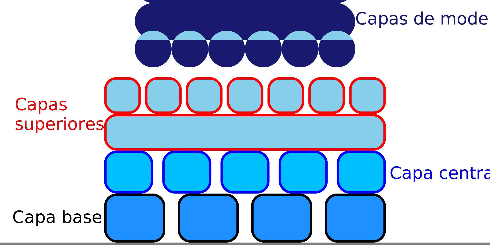

Impulso de impresión de balsa intermedia
====
<!--if cura_version<5.0:Este ajuste configura la velocidad a la que la boquilla puede pasar por las esquinas mientras se imprime la capa media de la balsa. La velocidad de sacudida durante la capa media de la balsa puede configurarse por separado de las capas base y superior.-->
<!--if cura_version>=5.0-->Este ajuste configura la velocidad a la que la boquilla puede pasar por las esquinas mientras se imprimen las capas medias de la balsa. La velocidad de paso durante las capas intermedias de la balsa puede configurarse por separado de las capas base y superior.<!--endif-->

Dado que la balsa se compone generalmente de segmentos de línea largos, el aumento de la tasa de sacudidas normalmente tiene muy poco impacto en el tiempo de impresión. Sin embargo, aumentar la tasa de impulso ahorrará un poco de tiempo al pasar por las esquinas al final de las líneas.

Aumentar la tasa de impulso causará que la impresora vibre más mientras se imprime <!--if cura_version<5.0:la capa intermedia--><!--if cura_version>=5.0-->las capas intermedias<!--endif--> de la balsa. Esto aumenta ligeramente el riesgo de arrancar la balsa de la placa de impresión.