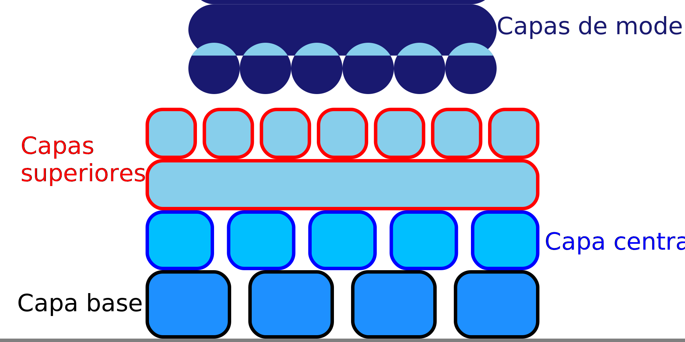

Capas intermedias de la balsa
====
La balsa puede tener cualquier número de capas intermedias. Este ajuste controla cuántas capas intermedias se imprimirán.

Tener más capas intermedias lleva más tiempo de impresión, pero aumenta mucho la rigidez de la balsa y protege más el modelo del calor de la placa de construcción. El mismo efecto se puede conseguir aumentando las [capas superiores de la balsa](raft_surface_layers.md). Sin embargo, las capas superiores están afinadas para producir una superficie lisa agradable, que puede tomar mucho tiempo para imprimir si hay muchas capas. Las capas intermedias no necesitan ser lisas, por lo que tener muchas de ellas no tiene un gran impacto en el tiempo de impresión.