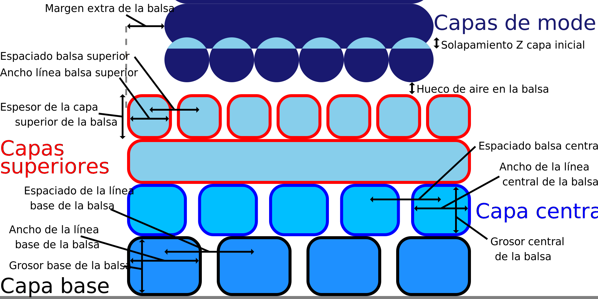

Margen adicional de la balsa
====
Este ajuste hace que la balsa sea más ancha que el modelo. Indica el ancho del margen extra alrededor del modelo.

Aumentar este ajuste mejorará en gran medida la adherencia entre la balsa y la placa de construcción. No sólo hay una mayor área para que la balsa se adhiera a la placa de construcción, sino que las expansiones también suavizan las esquinas de la balsa. Con esquinas más suaves, el alabeo tendrá menos efecto en la balsa. En segundo lugar, una balsa más grande le permite separar la balsa del modelo con más facilidad, ya que hay un área para agarrar la balsa.

Sin embargo, el aumento del margen extra de la balsa también ocupará más espacio en la placa de construcción. Se necesitará más material y tiempo para imprimir la balsa.