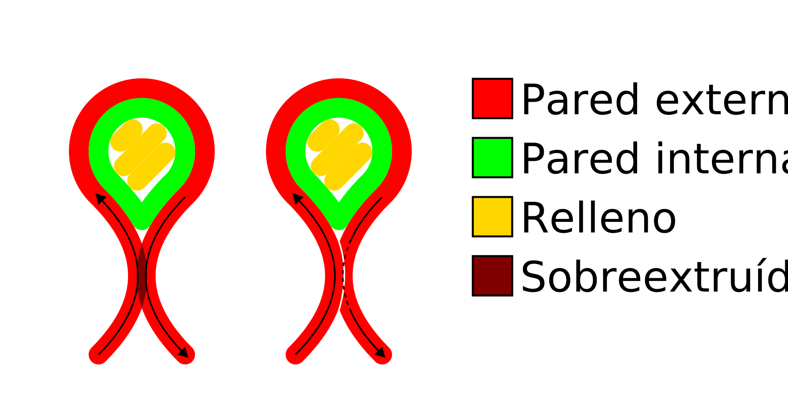

Compensar solapamientos de paredes
====
Cuando se imprimen piezas delgadas, las paredes opuestas pueden acercarse lo suficiente como para superponerse. Si se imprimen ambas paredes con su ancho de línea normal, se sobreextruirían. Este ajuste evita esa sobreextrusión reduciendo el ancho de una de las líneas, impidiendo esta sobreextrusión y consiguiendo una mayor precisión dimensional.

El ancho de la línea de la pared que se solapa con otra pared se reduce en función del área de solapamiento. Esto compensa la sobreextrusión.

Como se ha descrito anteriormente, esta característica tiende a mejorar la precisión dimensional. Sin embargo, la desventaja es que el caudal se vuelve menos uniforme, lo que provoca una subextrusión en algunos lugares y una sobreextrusión en otros. Además, el caudal puede reducirse por debajo del caudal mínimo de la boquilla y de la configuración del extrusor, lo que provoca un flujo inconsistente y un rebordeado. Para reducir este efecto, puede establecer el [Flujo mínimo de la pared](wall_min_flow.md) que convertirá algunas de las paredes más finas en movimientos de desplazamiento a costa de la precisión dimensional.

**Este ajuste tiende a parecer más desordenado en la vista de capas. En la impresión real, no hay bordes entre las líneas. La vista de capas muestra sólo los recorridos del g-code, pero en realidad el material es empujado a un lado por la otra pared con la que se solapa. Además, las pequeñas reducciones en el flujo no se manifestarán en la impresión real, ya que la tasa de flujo a través de la boquilla no puede ajustarse tan rápido. Estos efectos hacen que la impresión real sea más suave de lo que la vista de capas predice.**