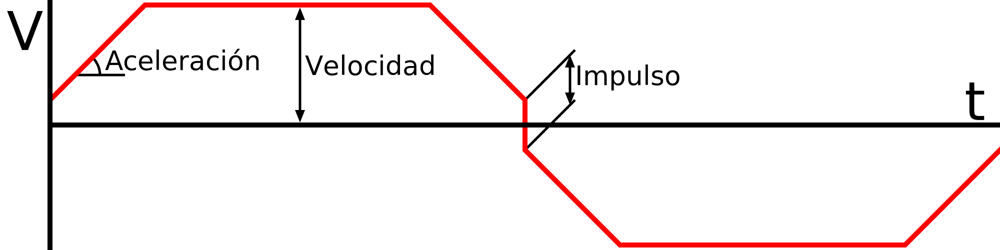

Activar el control de impulso
====
El control de impulso determina la velocidad a la que la boquilla puede pasar por las esquinas. Si el control de impulso está activado, Cura tomará el control de la cantidad de impulsos que se aplicarán durante varias partes de la impresión. Si está desactivado, el firmware de la impresora elegirá un valor de impulso. El valor de impulso de la impresora suele ser bastante alto para dar más control al cortador, pero puede tener más información sobre su propio hardware que la que tiene Cura. 

**'Impulso' en impresión 3D no es lo mismo que 'impulso' en física** El término "impulso" fue introducido por Marlin. Fue diseñado allí como una solución para el problema inherente al tratar de seguir perfectamente una trayectoria. Como la boquilla no puede desviarse de la trayectoria (en teoría), la boquilla tendría que desacelerar a 0 mm/s en cada esquina. Esto arruinaría su impresión, porque desacelerar a 0mm/s causaría una mancha en cada esquina. No se permite hacer curvas para acortar la esquina, ni puede sobrepasar la velocidad. En su lugar, Marlin permite un cambio instantáneo en el vector de velocidad en cada esquina. La magnitud de este cambio en el vector velocidad se denomina "impulso".

Así pues, el impulso es el máximo cambio instantáneo de la velocidad, aplicado en cada esquina del movimiento.

El firmware que no está basado en Marlin, como la familia de firmware Sailfish, ignorará los cambios en el jerk. Este ajuste no tendrá entonces ningún efecto.

Ejemplo de matemáticas de impulso
----
Como ejemplo, tome una impresión muy simple: Primero mueva 100mm hacia la derecha, luego mueva 100mm hacia abajo. La velocidad de impresión se establece en 50mm/s. La aceleración se establece en 1000mm/s^2. El impulso se establece en 10mm/s. Esto es lo que sucederá:
1. Al inicio de la impresión, Marlin tarda la mitad del valor del impulso en comenzar, por lo que teóricamente acelerará a 5mm/s instantáneamente.
2. Con una aceleración de 1000mm/s^2, tardará 0,045s en acelerar desde 5mm/s hasta la velocidad máxima de 50mm/s. Durante este tiempo, la boquilla recorrerá 1,2375mm.
3. La boquilla navega durante un tiempo a 50mm/s, la velocidad máxima de impresión.
4. Marlin calculará a qué velocidad puede pasar la boquilla por la esquina: La boquilla hará una curva de 90 grados, primero hacia la derecha y luego hacia abajo. Para limitar este cambio de velocidad, entrará en la esquina a cos(90/2) * (10/2)mm/s yendo hacia la derecha, y saldrá a cos(90/2) * (10/2)mm/s yendo hacia abajo. Así que pasará por la esquina a unos 7,07 mm/s.
5. Tardará 0,043s en desacelerar desde una velocidad de 50mm/s a 7,07mm/s.
6. La curva se realiza con un cambio de velocidad instantáneo. La magnitud de la diferencia entre los vectores [7,07, 0] y [0, 7,07] es exactamente 10mm/s, por lo que puede realizar esta curva instantáneamente.
7. Tardará 0,043s en acelerar de 7,07mm/s a 50mm/s.
8. La boquilla vuelve a navegar un rato a 50mm/s, la velocidad máxima de impresión.
9. Hacia el final de la impresión, la boquilla desacelerará de 50mm/s a 0mm/s en 0,05s.