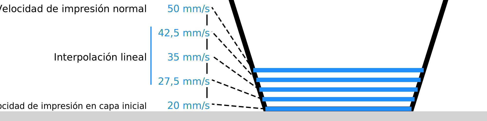

Número de capas más lentas
====
La capa inicial no es la única que se imprime más lentamente. Este ajuste configura el número de capas que se imprimen más lentamente. A lo largo de estas capas, la velocidad de impresión aumentará gradualmente hasta alcanzar la velocidad de impresión normal.

A partir de la capa inicial, la velocidad aumenta (o disminuye) linealmente hasta la velocidad de impresión ordinaria. Esto sucede por separado para las paredes, la piel, el relleno, etc., si se imprimen a diferentes velocidades.

Hay dos razones por las que podría querer pasar a la velocidad de impresión normal en varias capas. En primer lugar, la segunda y tercera capa están todavía bastante cerca de la placa de construcción, y el movimiento rápido sobre ellos puede rasgar la impresión con bastante facilidad. En segundo lugar, la diferencia de caudal entre la velocidad de impresión de la capa inicial y la velocidad de impresión normal puede ser tan grande que el gran cambio de caudal puede tardar en surtir efecto. La transición lenta evita que se produzcan subextracciones con un gran cambio de velocidad.

Sin embargo, la transición lenta también hará que la impresión dure más tiempo en total.