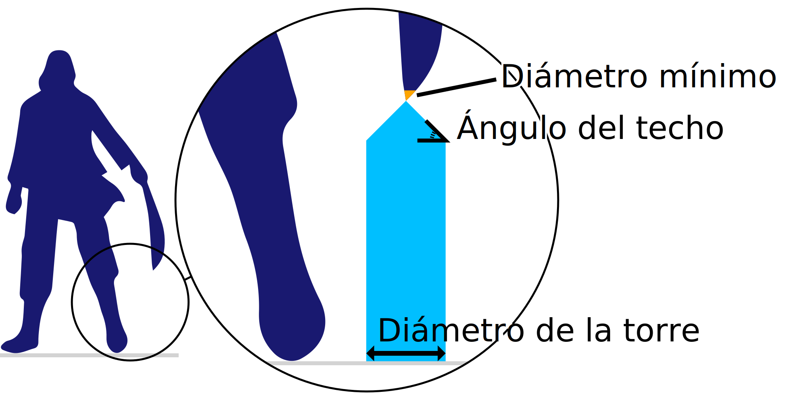

Diámetro mínimo
====
Este ajuste es un umbral para el diámetro de una pieza de voladizo para elegir entre soporte normal y torres de soporte. Si la pieza es más delgada que este umbral, será soportada por una [torre de soporte](support_use_towers.md). Si es más ancha que este umbral, se apoyará en las estructuras de soporte normales.

Si una franja muy fina de voladizo necesita soporte, el soporte normal se derrumbaría. Dicho soporte es demasiado torcido para imprimirse correctamente. En su lugar, se genera una torre más robusta.

Aumentar este ajuste hará que las torres se generen con más frecuencia. Esto aumenta la fiabilidad del soporte, pero también requiere un poco más de material y tiempo de impresión.