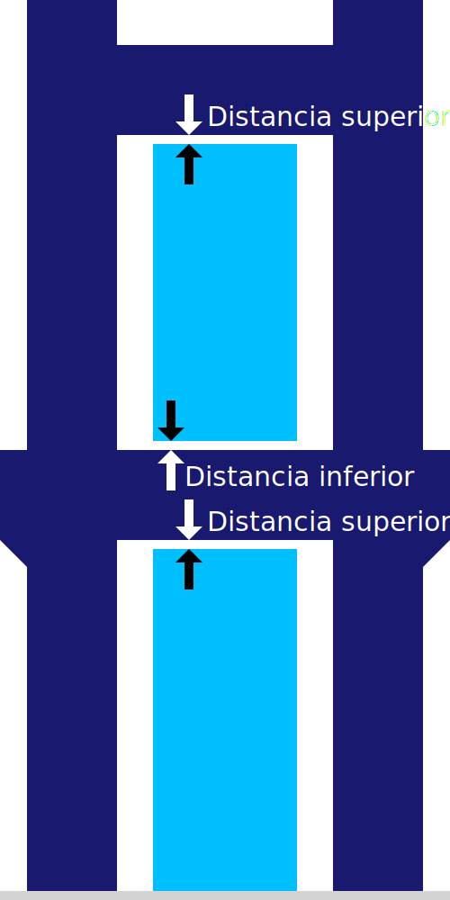

Distancia superior del soporte
====
Este ajuste configura la distancia que se mantiene entre la parte superior del soporte y la superficie sobresaliente del modelo.

<!--screenshot {
"image_path": "support_z_distance.png",
"models": [{"script": "rack.scad"}],
"camera_position": [0, 129, 11],
"settings": {
    "support_enable": true,
    "support_z_distance": 1
},
"colours": 32
}-->

La distancia superior del soporte es el factor que más influye en la adherencia del soporte al modelo cuando éste se apoya en el soporte. Aumentar la distancia facilita la eliminación del soporte después de la impresión, ya que no se adherirá bien al objeto impreso. Sin embargo, también hará que el voladizo se vea peor, ya que se permite que se hunda unas cuantas capas más antes de apoyarse en el soporte.