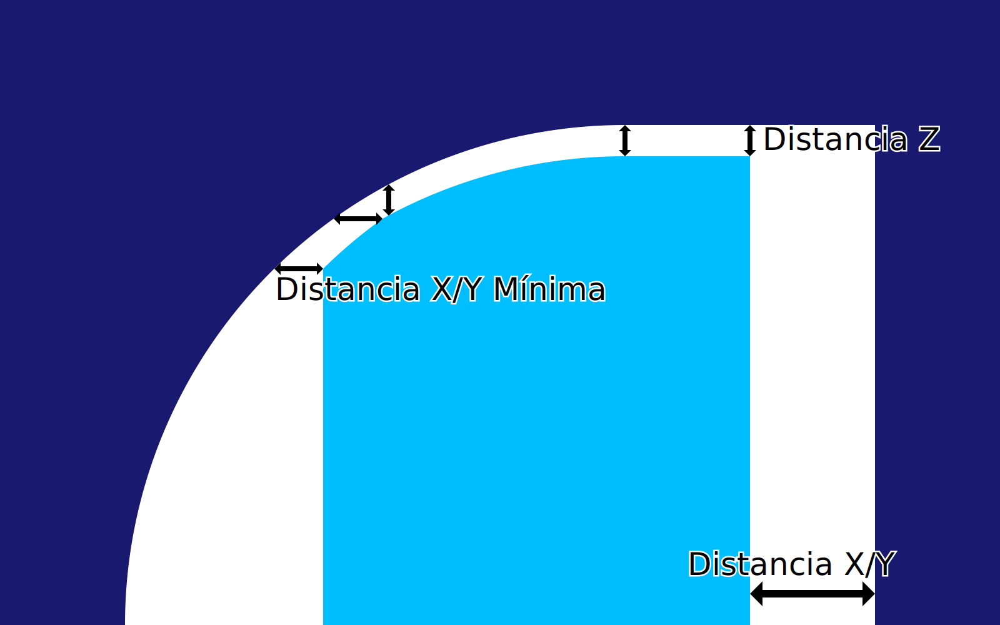

Distancia X/Y del soporte
====
Indica la distancia que debe mantenerse horizontalmente entre el soporte y el modelo.

<!--screenshot {
"image_path": "support_xy_distance.png",
"models": [{"script": "clamp.scad"}],
"camera_position": [-8, 185, 42],
"settings": {
    "support_enable": true,
    "support_xy_overrides_z": true,
    "support_xy_distance": 2
},
"colours": 64
}-->

La distancia horizontal tiene por objeto evitar que el soporte golpee el modelo, donde dejaría una cicatriz en la superficie. Sin embargo, esto también crea una mayor distancia entre el modelo y la estructura de soporte donde está el voladizo, dejando los voladizos más pequeños sin soporte.

Distancia X/Y frente a Z
----
Tanto la distancia X/Y como la distancia Z deben respetarse exactamente; ni más ni menos. Esto es un exceso de restricciones, por lo que debe haber una preferencia entre las dos. Esto se indica mediante el ajuste [Support Distance Priority](support_xy_overrides_z.md). Este ajuste cambia el comportamiento de este ajuste de Distancia X/Y de soporte.

Si X/Y anula a Z, la distancia X/Y se mantiene, incluso si eso significa que la distancia Z es demasiado grande. La distancia Z sigue siendo la mínima.

Si Z anula a X/Y, la distancia Z se mantiene, incluso si eso significa que la distancia X/Y es demasiado pequeña. La distancia X/Y sólo tiene influencia en la parte superior del soporte, donde la distancia Z no tiene influencia.