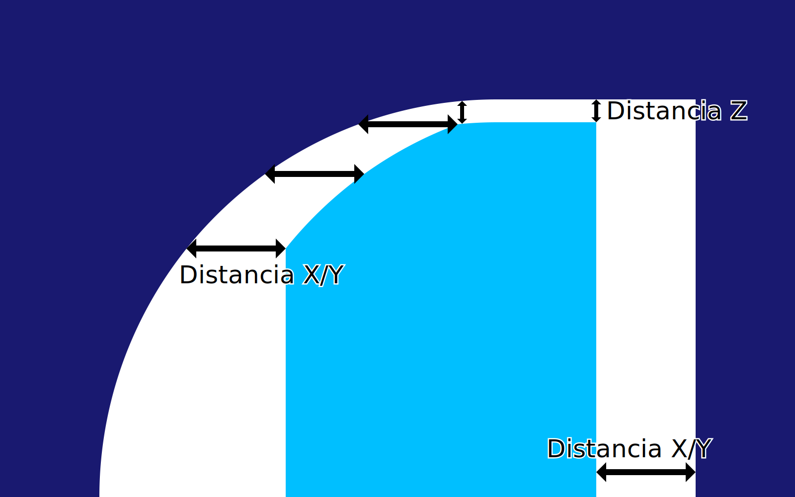
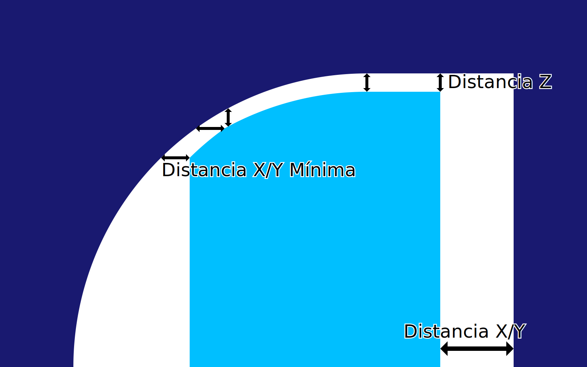

Prioridad de las distancias del soporte
====
Tanto la [distancia X/Y](support_xy_distance.md) como la [distancia Z](support_z_distance.md) del soporte deben ser observadas exactamente; ni más, ni menos. Esto es un exceso de restricciones, por lo que debe haber una preferencia entre los dos. Este ajuste determina esa preferencia.

X/Y anula a Z
----

Si la distancia X/Y anula la distancia Z, la distancia X/Y se mantiene siempre constante, incluso si eso significa que la distancia Z es mayor de lo deseado. Sin embargo, la distancia Z se mantiene como una distancia mínima, por lo que si el voladizo es muy horizontal, la distancia Z sigue actuando, haciendo que la distancia X/Y sea mayor de lo deseado.

Z anula a X/Y
----

Si la distancia Z anula la distancia X/Y, entonces la distancia Z se mantiene siempre constante, incluso si eso significa que la distancia X/Y es menor de lo deseado. La distancia X/Y sólo influye en la impresión en los lugares donde la distancia Z no entra en juego, es decir, no en la parte superior de las estructuras de soporte, sino sólo en los laterales.

Sin embargo, se sigue observando una distancia mínima X/Y. Si el voladizo es muy vertical, la distancia X/Y sería tan pequeña que el soporte podría fundirse con los lados del modelo. La [Distancia mínima X/Y](support_xy_distance_overhang.md) lo evita.