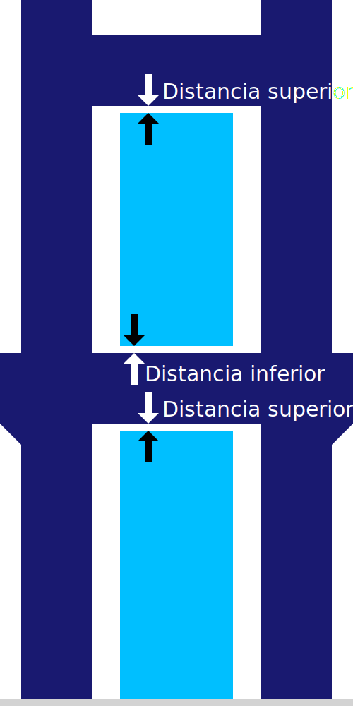

Distancia en Z del soporte
====
Este ajuste indica la distancia vertical que debe mantenerse entre el soporte y el modelo, tanto en la parte superior del soporte como en la inferior.

<!--screenshot {
"image_path": "support_z_distance.png",
"models": [{"script": "rack.scad"}],
"camera_position": [0, 129, 11],
"settings": {
    "support_enable": true,
    "support_z_distance": 1
},
"colours": 32
}-->

Este ajuste es el factor que más influye en la adherencia del soporte al modelo.

Si se reduce este ajuste, el soporte se pegará mejor al modelo. Esto hace que los voladizos se vean mejor, ya que no se les permite combarse tanto. También mejorará la estabilidad del soporte, ya que se posiciona firmemente sobre el modelo en la parte inferior del soporte.

Si se aumenta este ajuste, el soporte será más fácil de quitar. No dejará tanta cicatriz en la superficie donde el soporte estaba apoyando el modelo. Por otro lado, el modelo no tendrá tanto soporte. Esto reduce la calidad de la superficie de los voladizos.

Como regla general, cuanto mejor se adhiera el material de soporte al material de impresión, mayor debe ser este ajuste. Si estás utilizando un material diferente para imprimir el soporte, la distancia Z se puede reducir considerablemente, ya que dos materiales diferentes tienden a separarse más fácilmente después de la solidificación. Si se utiliza un material con buena unión de capas, el ajuste debe aumentarse un poco. La impresión en caliente o con líneas más gruesas también aumenta la adhesión, por lo que también es necesario aumentar este ajuste.