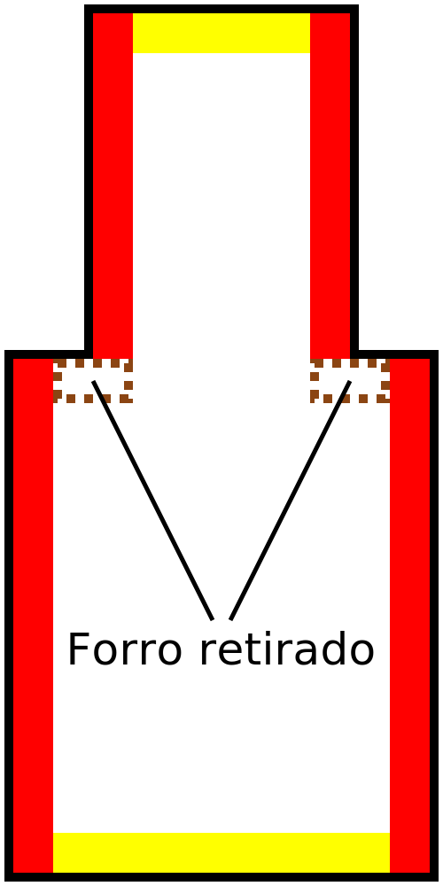

Anchura de retirada del forro
====
Este ajuste eliminará tiras muy finas de forro, sustituyéndolas por relleno.

El forro sólo se eliminará si hay relleno al lado, por lo que no eliminará el forro en la parte superior o inferior de su impresión, incluso si es muy fino.

<!--screenshot {
"image_path": "skin_preshrink_original.png",
"models": [{"script": "stature_symmetrical.scad"}],
"camera_position": [104, -7, 4],
"settings": {
    "wall_line_count": 0,
    "infill_wall_line_count": 1,
    "bottom_skin_preshrink": 0,
    "top_skin_preshrink": 0,
    "max_skin_angle_for_expansion": 89
},
"colours": 32
}-->
<!--screenshot {
"image_path": "skin_preshrink_shrunk.png",
"models": [{"script": "stature_symmetrical.scad"}],
"camera_position": [104, -7, 4],
"settings": {
    "wall_line_count": 0,
    "infill_wall_line_count": 1,
    "bottom_skin_preshrink": 1,
    "top_skin_preshrink": 1,
    "max_skin_angle_for_expansion": 89
},
"colours": 32
}-->

El forro se generará normalmente en cualquier lugar que esté verticalmente cerca de la parte superior o inferior del objeto. Esto no es necesario en todas partes. Las paredes verticales suelen ser lo suficientemente fuertes, por lo que aunque normalmente debería haber forro junto a las paredes verticales, este ajuste permite omitirlo. Esto ahorra tiempo de impresión y material.

Para la mayoría de las impresiones, ajustar esto a 1 o 2 anchos de línea es útil para reducir el tiempo de impresión. Además, si el forro es demasiado fina para imprimir, Cura dejará un hueco donde debería haber estado la forro (pero era demasiado pequeña). El relleno no se conectará correctamente a las paredes. Si se activa [Rellenar huecos entre paredes](../shell/fill_perimeter_gaps.md), estos huecos se rellenarán, pero ese método de relleno tarda más tiempo en imprimirse que el forro normal. Ajustar esta configuración al menos a la [Anchura de línea superior/inferior](../resolution/skin_line_width.md) evita que eso ocurra.

Si el ajuste se incrementa demasiado, pueden aparecer huecos en la superficie superior e inferior donde el relleno queda expuesto. En particular, tenga mucho cuidado con los modelos que tienen salientes delgados que deben conseguir una tira delgada de forro.

<!--screenshot {
"image_path": "skin_preshrink_problem_screenshot.png",
"models": [{"script": "thin_ridge.scad"}],
"camera_position": [64, 0, 100],
"settings": {
    "wall_line_count": 3,
    "top_skin_preshrink": 5
},
"colours": 64
}-->

