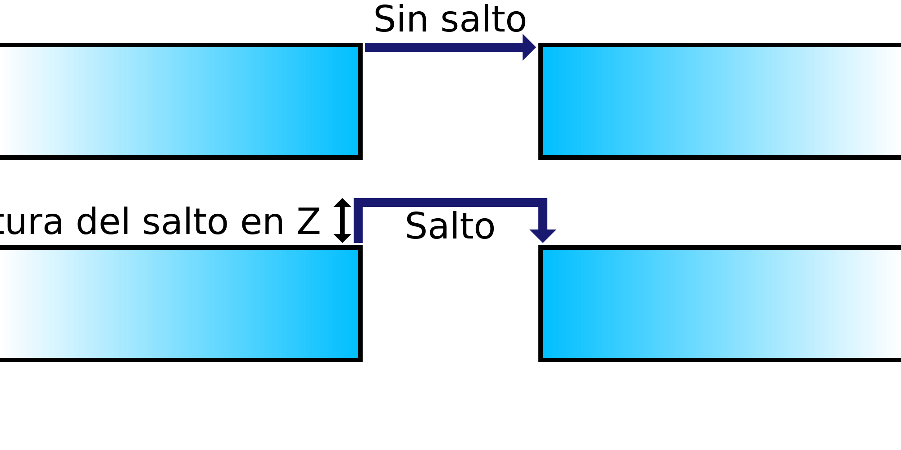

Altura del salto en Z
====
Si se realiza un salto en Z, este ajuste determina la altura a la que se desplazará la boquilla antes de llegar al destino.

Dado que la velocidad Z es hasta 2 órdenes de magnitud más lenta que las velocidades X/Y, los saltos Z pueden requerir mucho tiempo.

Los saltos Z más altos requieren más tiempo, lo que puede aumentar significativamente el tiempo total de impresión y también aumenta ligeramente la cantidad de rezuma,
Sin embargo, pasar demasiado bajo sobre la superficie permite que el exudado de la boquilla golpee el modelo de todos modos, derrotando el propósito del salto Z.
